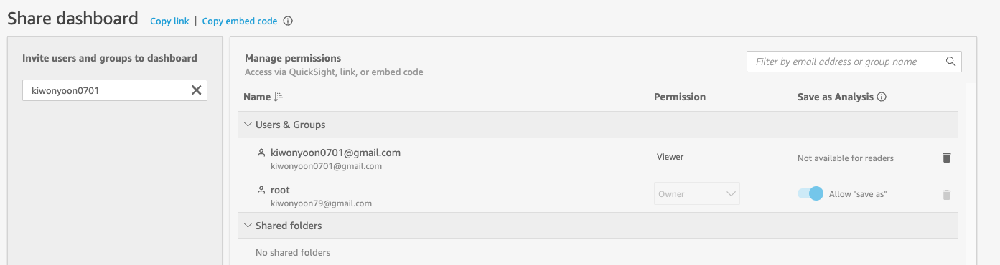

## Quicksight Demo

---

### AI/ML 추론 예측 / 실측 비교

---

#### 추론 결과 / 실측 결과 저장 및 조회 방법에 따른 Demo


|                      Type                      | 장점                                          | 단점                                  |
| :--------------------------------------------: | --------------------------------------------- | ------------------------------------- |
| 사용자가 CSV File로 Daily/Weekly로 수동 Upload | 직관적, 간략한 분석 용이                      | 사용자의 수동 개입 필요/자동화 어려움 |
|             S3 - Athena View 활용              | Query(View) 사용 가능 / 추가 데이터 조회 용이 | S3 / Glue / Athena 설정 필요          |
|                RDBMS 등 DB 활용                | Query 사용 가능 / 추가 데이터 조회 용이       | 별도의 관리용 Database 필요           |
|                                                |                                               |                                       |


---

### 사용자가 CSV로 수동 Upload 방법

1. New DataSet
2. Upload a file - 

```
/Users/kiwony/Documents/GitHub/Quicksight/20220606.Retail/ml-raw-data
ML1.csv

20220101 ~ 20220110까지 Data
```

3. Edit

```
Column 소개
```

4. Save & Publish

5. Publish & Visualize 

---

1. KPI

```
+Accuracy
+Date

*Difference as Percent

*Title : 공항별 라운지 이용자 예측 정확도 percentage 추이

Create Filter
2022-01-04
2022-01-06

Delete Filter
```

---

2. Cluster Bar Stack

```
Resize

+Date
+Error(avg)
+City
+Actual

**RESIZE

* Data Label
Check

* Title
공항별 라운지 이용자 예측 및 실측치 비교

Error => Average
Error => Percent
1000% 이상으로 나옴
```

**Calculated Field**

```
Error-Percent
{Error}/100
Error ====> Error-Percent(avg)
Error-Percent => Percent
```

City를 넣었다 빼면서 Drill Down

```
city를 GROUP에서 넣었다 빼기
```


---

3. Donuts

```
City
Actual

* Data Label - show metric
Actual => Average

* Title
공항별 평균 라운지 이용 고객수
```

---

4. Donuts-2

```
Duplicate

Actual ===> Difference(Average)

* Title : 공항별 예측/실제 방문 고객수 차이
```

---

5. Gauge

```
Accuray(Average)

```

**Calculated Field**

```
Accuracy-Goal
100
Target : Accuracy-Goal(Avg)

++Resize 70%
```

---

6. Line Chart

```
Date
Actual(avg)
city

**Resize

*Title : 공항별 방문자 추이

```

---

7. Stacked area line 

```
Date
Actual(avg)
city

++Resize 70%
```

---

8. Table

```
Date , City
Predict, actual, difference, accuray, error

Pivot

++Resize
```

---

9. Pivotable

```
Date
City
Predict, Actual, Difference, Accuracy, Error

Pivot
```

**Conditional Formatting-1**

```
...
Error(avg)
Greater than 50 : RED
Grather than 25 : Yellow
Less than 25 : Green

```

**Conditional Formatting-2**

```
...
Difference(avg)
Gradient
Min : 25
Max : 100
```

---

10. Filter Control추가(공항별 Filter)

```
Filter - Create one
City
All application visuals
...
Add to Sheet
GMP
CJU
JFK
+설정 
+Name : 공항
```

---

11. Filter Control추가(Date)

```
Filter - Create one
All application visuals
Start : 2022/01/01
End : 2023/01/01
...
Add to Sheet
Start : 2022/01/01
End : 2022/01/06
+설정
+Name : 날짜 선택
+Format : YYYY/MM/DD
```

---

12. Sheet Name, Visualize 변경

```
Sheet Name : Lounge-Usage-ML
Accuracy-Goal => 목표 대비 정확도
선그래프 => 공항별-날짜별 실제 라운지 사용자 총합
Stack Graph => 전체 이용자수 대비 공항별 사용자 비율
Table => 공항별-날짜별 라운지 사용자 RAW Data
Pivot Table => 고오차율 및 실제 사용자 Gap Highlight Data

```

---

13. Theme 변경

---

14. PDF출력

```
export => Download as PDF
```

---

15. Manager Users

```
kiwonyoon0701@gmail.com +
Reader / No
Accept Invitation
Password 설정
```

**Dashbaord** Click

```
Share => Share Dashboard

```



```
Copy link
Login
Pivot Table => CSV download
```

---

16. Send emap report

```
Share => send an email report
Save Report
+Repeat once a week 
+Update and send report once
```

---

17. Add Logo

```
Add Visual
Custom visual content
URL : https://1000logos.net/wp-content/uploads/2020/03/Korean-Air-Logo-500x313.png
show as Image
```

---

## 사용자가 CSV로 수동 Upload 방법 + 추가 데이터

1. Save as => Save a copy => ML1_2
2. DataSet => New => ML1+ML2.csv => Edit => Save Publish
3. ML1_2 analysis => Edit data => Replace => ML1+ML2

---

## S3 - Glue - Athenw View 연동

1. S3 Bucket, Folder 생성

```
lounge-kiwony-20220713
lounge-usage-ml
```

2. glue db, catalog

```
lounge-usage
```

3. Athena view

```
lounge-usage-view
```

### 실습 

1. New Data Set => Athena

```
lounge-usage-athena-view
Database : lounge-usage
Tables : lounge-usage-ml
```

2. Visual 생성 - Vertical

```
Date, Error(avg), city, actual(sum)
```

3. 추가 Data S3 적재

```
ml2.csv
cd /Users/kiwony/Documents/GitHub/Quicksight/20220606.Retail/ml-raw-data
aws s3 cp ML2.csv s3://lounge-kiwony-20220713/lounge-usage-ml/

```

4. Athena에서 View 조회

5. QS에서 Data Edit

Query mode => Refresh now

6. Publish and visualize

```
30rows => 45rows
jan-15 data
```

---

## Oracle 연결

1. New Data Set => Oracle

```
Name : oracle-lounge-usage
database-2.cf89zyffo8dr.ap-northeast-2.rds.amazonaws.com
1521
ORCL
oshop
```

2. Use custom SQL

```
Name : lounge_usage_query
select * from lounge_usage order by mydate;
```

3. Edit
4. Save
5. Publish
6. Show
7. RemoteDeskTop

```
kal
@ml2.sql

```

8. Truncate table

```
@truncate
```

9. Refresh Screen
10. Edit Data
11. Refresh Full
12. Publish & Visualze
13. No Data 확인
14. Refresh
15. Importing 확인


