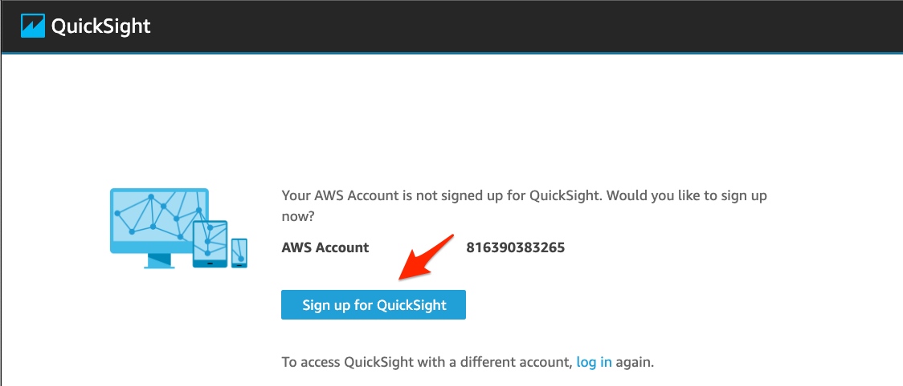
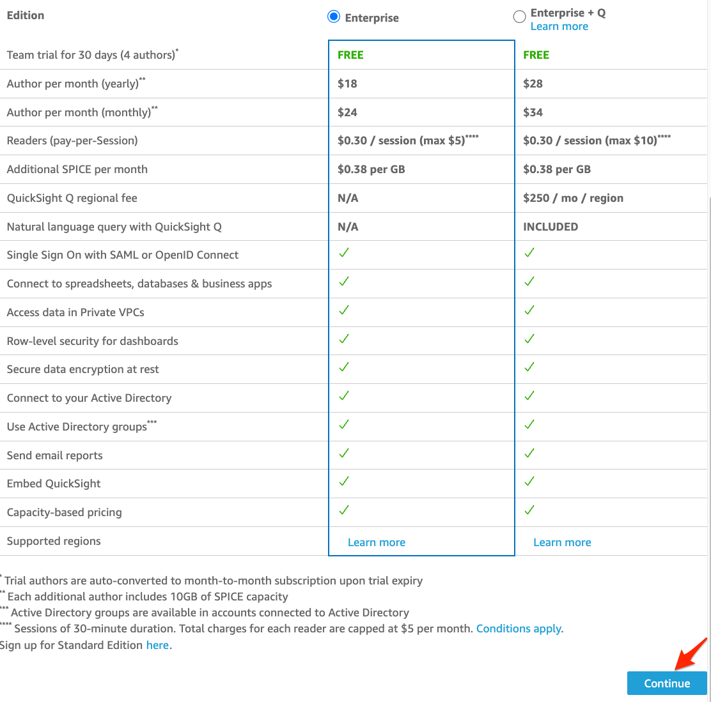
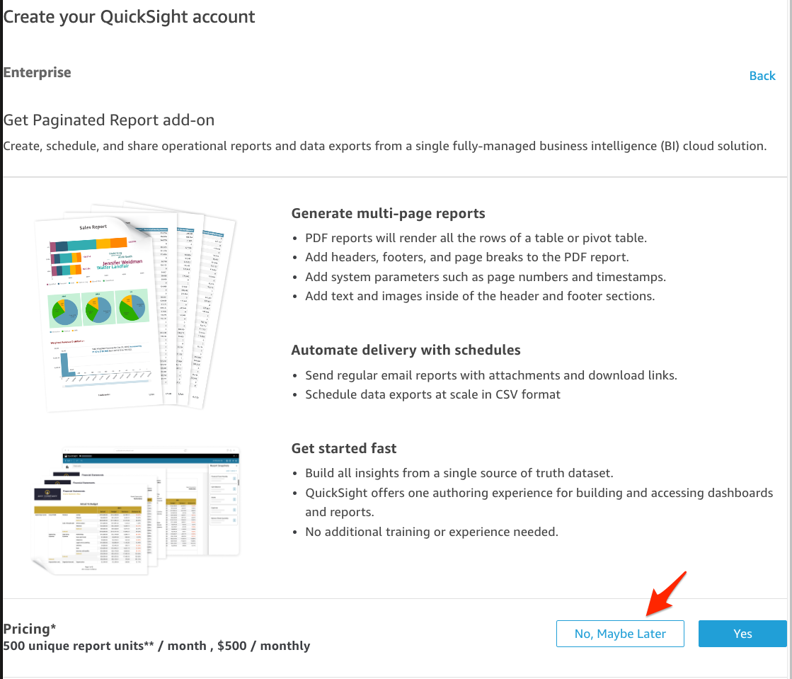
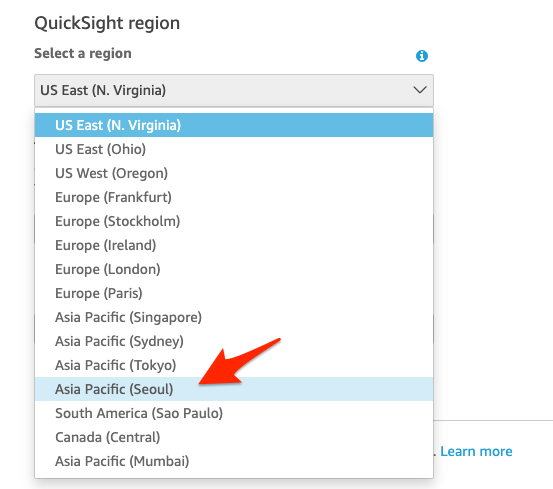
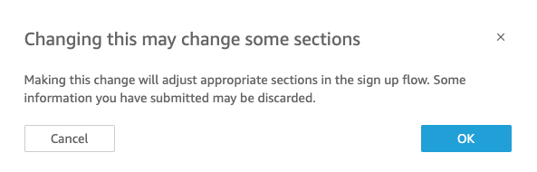
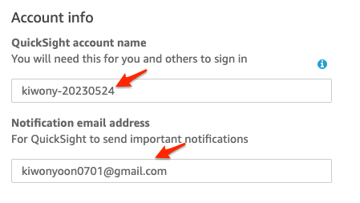
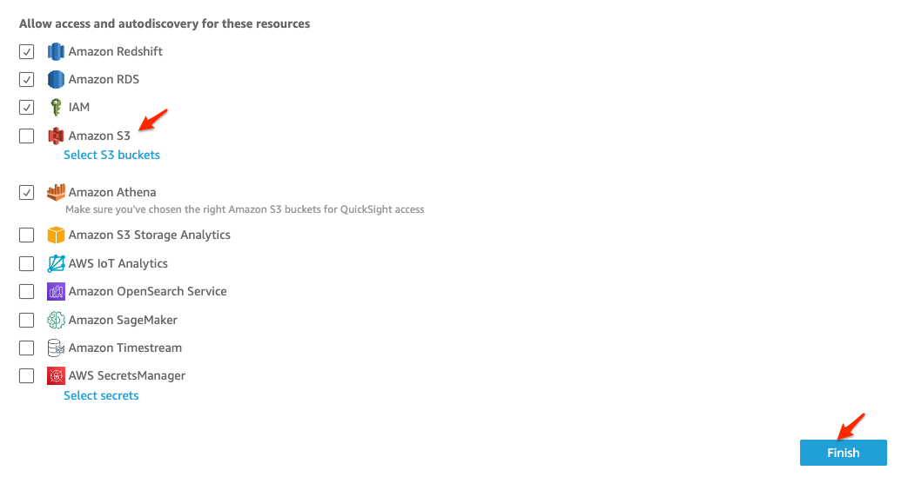
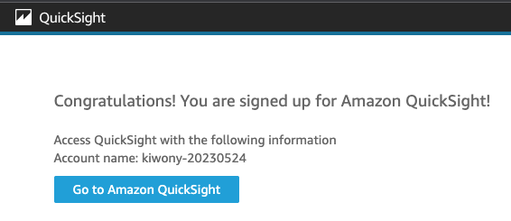

#### QuickSight 계정 생성

---

1. [여기 ](https://quicksight.aws.amazon.com/sn/start) 를 새 창(새 탭)으로 띄워서 **QuickSight**로 이동합니다.

   

---

2. **Sign up for QuickSight** Click

---

3. Default인 **Enterprise**를 선택 후 **Continue** Click

---

4. **Get Paginated Report add-on** 에서 **No, Maybe Later** 선택

---

5. **QuickSight Region**을 **Asia Pacific (Seoul)** 로 변경 후 **OK** Click

---

---

6. **QuickSight account name** 에 **영문이름-오늘날짜** 형식으로 입력하고, **Notification email address**에는 자신의 email을 입력

---

7. Data Source로 사용 할 Resource에 대한 접근을 허용하려면 **Allow access and autodiscovery for these resources** 에서 허용 가능. **Athena** 혹은 **S3 Bucket**을 Data Source로 사용 시 선택 필요
8. **Finish**를 Click 하여 QuickSight Account 생성

---

9. **Go to Amazon QuickSight** Click

---

10. SA와 함께 Hands-on을 진행합니다.

