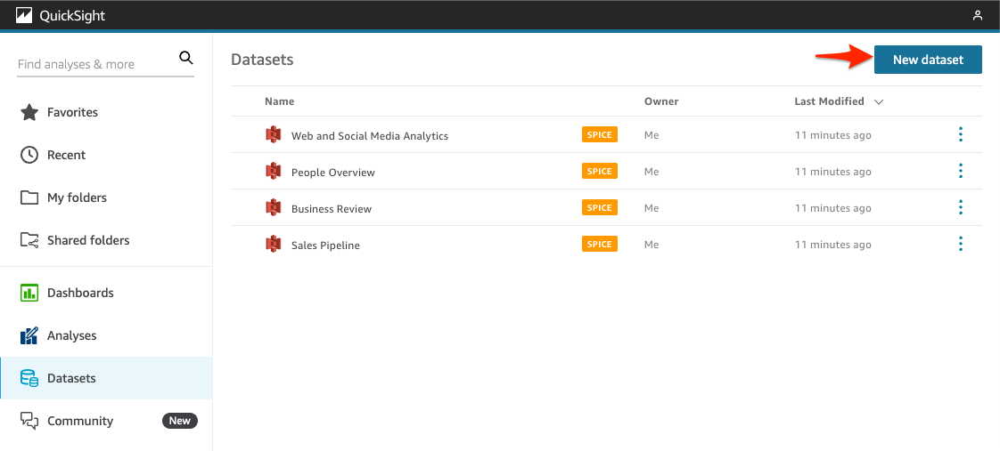
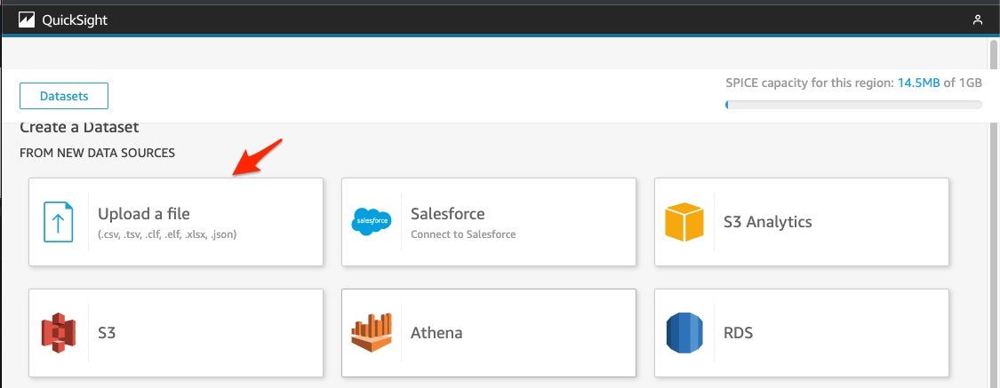
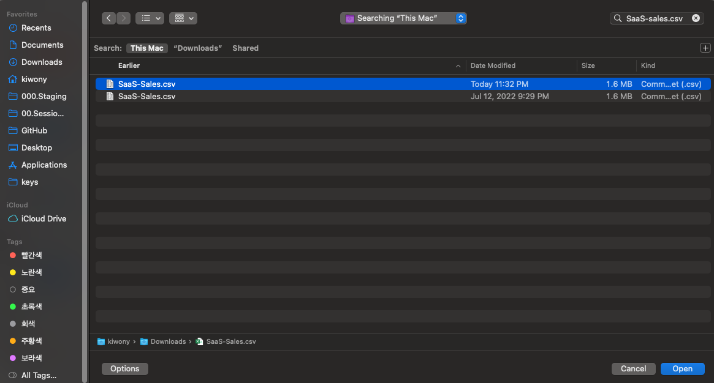
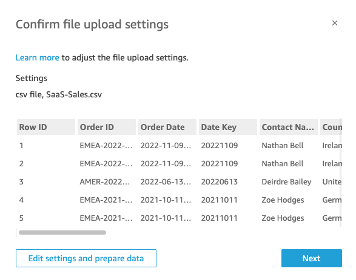
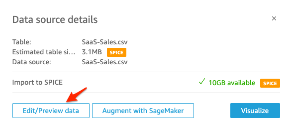
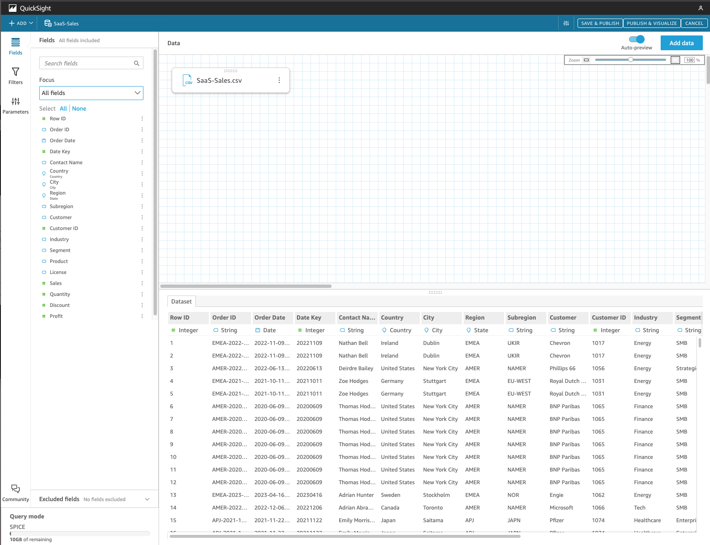
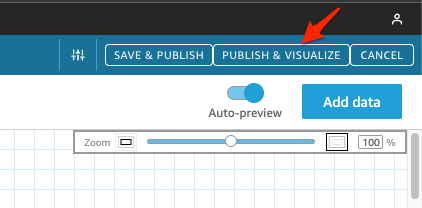
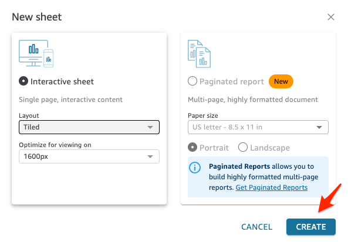

#### 첫번째 DashBoard 생성

---

1. [여기 ](https://shared-kiwony.s3.ap-northeast-2.amazonaws.com/SaaS-Sales.csv) 를 눌러 **SaaS-Sales.csv** 를 Download

   

---

2. [여기 ](https://ap-northeast-2.quicksight.aws.amazon.com/sn/start/data-sets) 를 눌러 **QuickSight - Datasets**  Console로 이동

---

3. **New dataset** Click

---

4. **Upload a file** Click

---

5. 방금 Download 했던 **SaaS-Sales.csv** 를 선택

---

6. **Next** Click 후  **Edit/Preview Data** Click

---

---

7. **Edit Data** 창에서는 다음의 작업들이 가능합니다.

   a. Data에 대한 미리 보기

   b. Calculated Filed 생성

   c. DataSet 간의 Join

   d. Field Name 및 Data Type 변경 가능

   e. Field Hierarchy 생성 가능

---

8. **Publish & Visualize** Click

---

9. **New Sheet** 화면에서 Default 값으로 두고 **CREATE** Click

---

### 이후 Step 은 SA와 함께 진행합니다.

