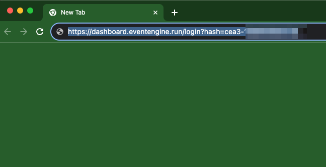
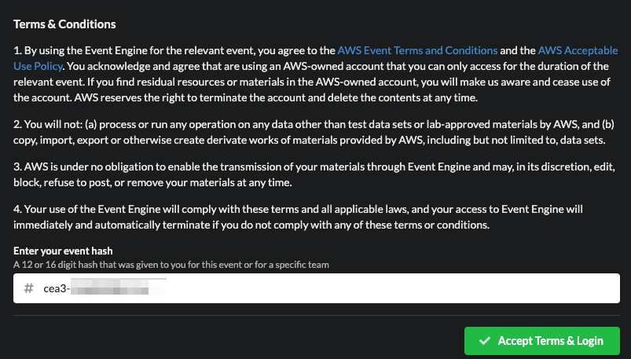
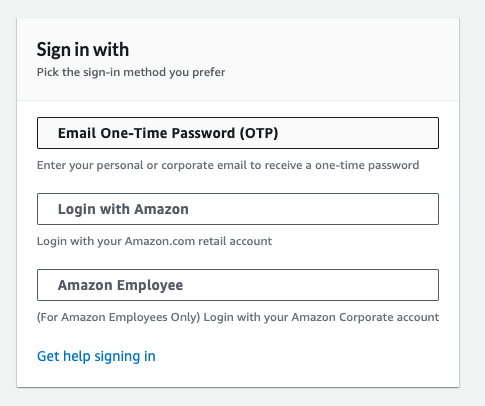
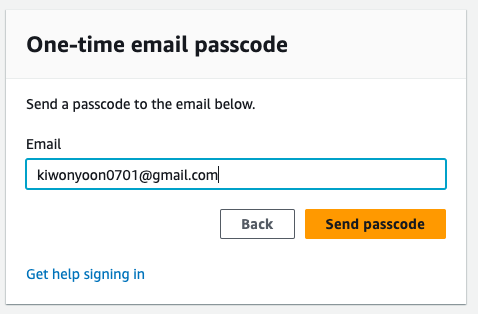
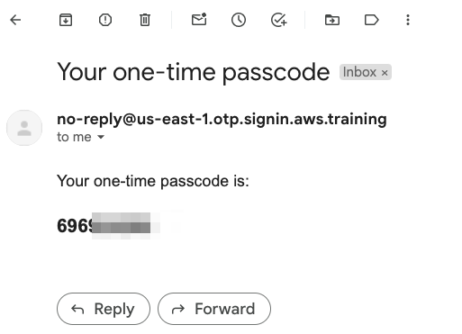
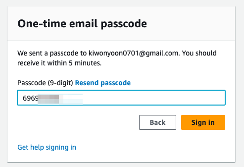
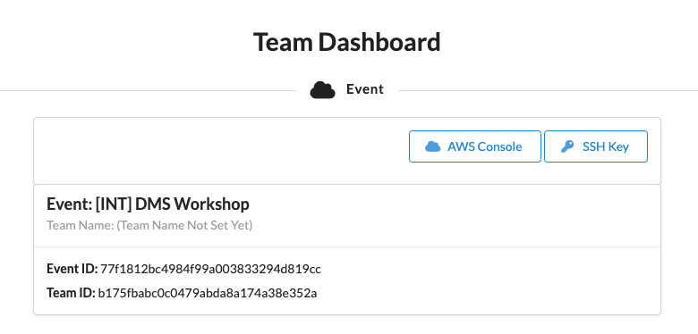
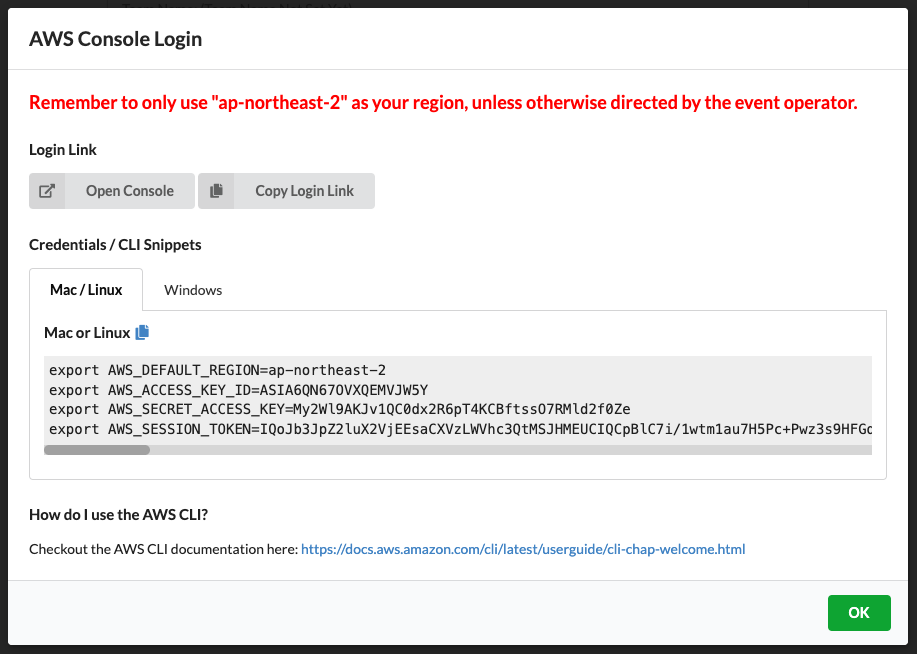

# QuickSight GENBI TF 계정 사용법

---

### 실습 환경 접속 및 GENBI Enable 방법

1. 제공 받은 Hash URL을 이용해서 환경에 접속합니다.

---

2. **Accept Terms & Login** Click

---

3. **Email One-Time Passowrd(OTP)** 을 Click하여 OTP Code를 확인합니다.

---

4. Email 입력

---

5. Email에서 확인한 Code를 입력

---

6. **AWS Console** => **Open Console** Click

---

[<다음> 실습 DB 생성](./02.md)

