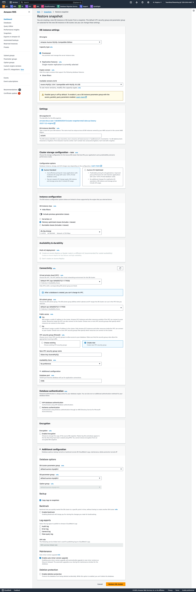
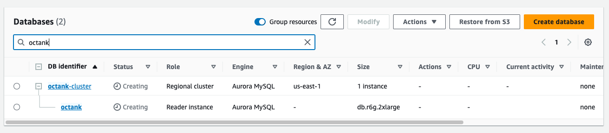
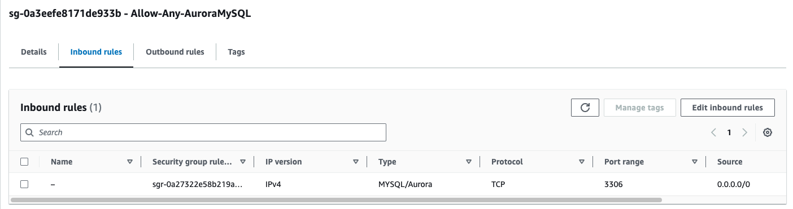

# Aurora MySQL Cluster 생성


---

### Aurora MySQL 생성

---

1. 다음의 Link로 접속 https://go.aws/3RkJAll


---

2. 다음처럼 설정 후 **Restore DB Cluster** Click - 명시되지 않은 값들은 Default 사용

```
DB instance identifier : octank
Public Access : Yes
VPC security group (firewall):
 - Create New
 New VPC security group name : Allow-Any-AuroraMySQL
```




---

3. DB Cluster가 생성 되는 것을 확인 합니다.




---

4. Security Group **Allow-Any-AuroraMySQL** 을 Any 에서 접속 가능하게 수정합니다.



---

[<다음> QuickSight 계정 생성](./03.md)

