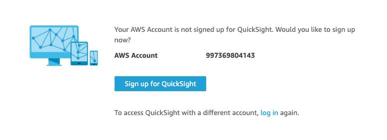
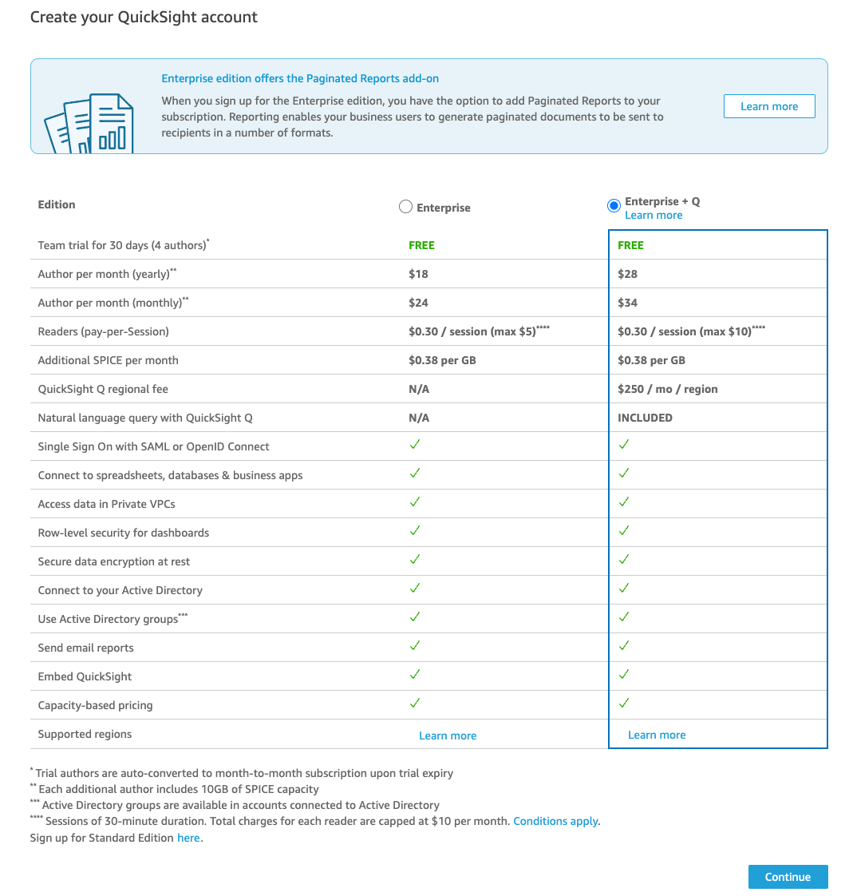
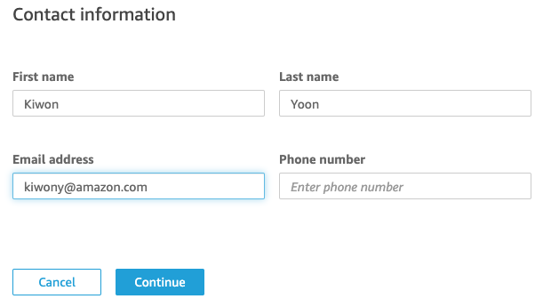
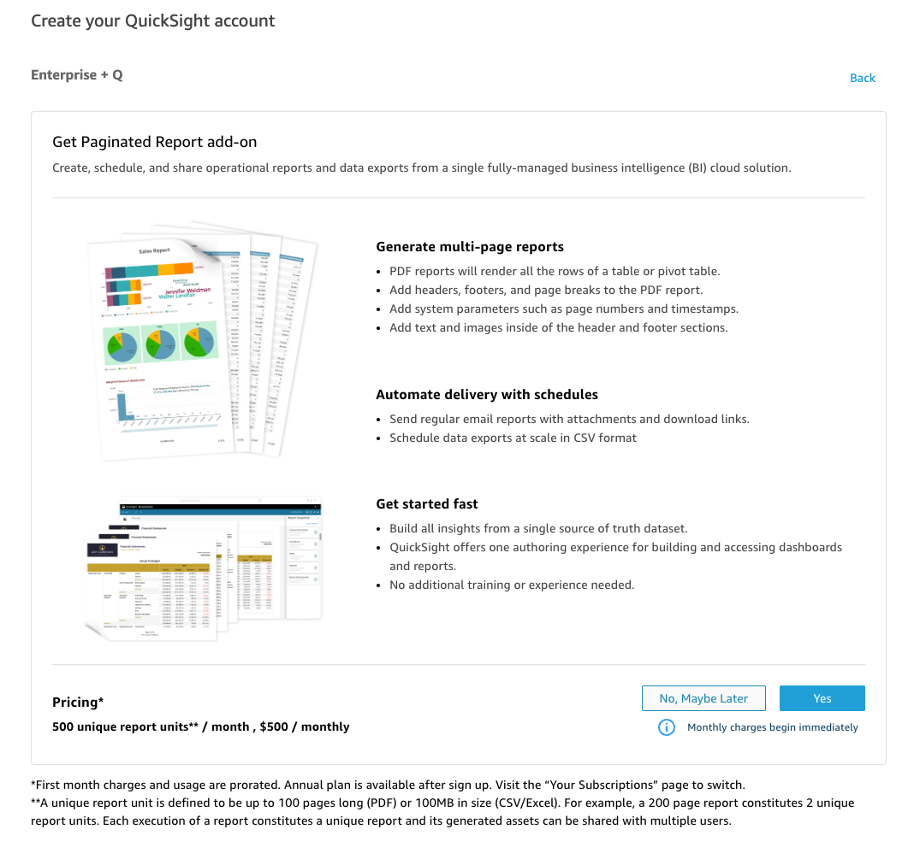
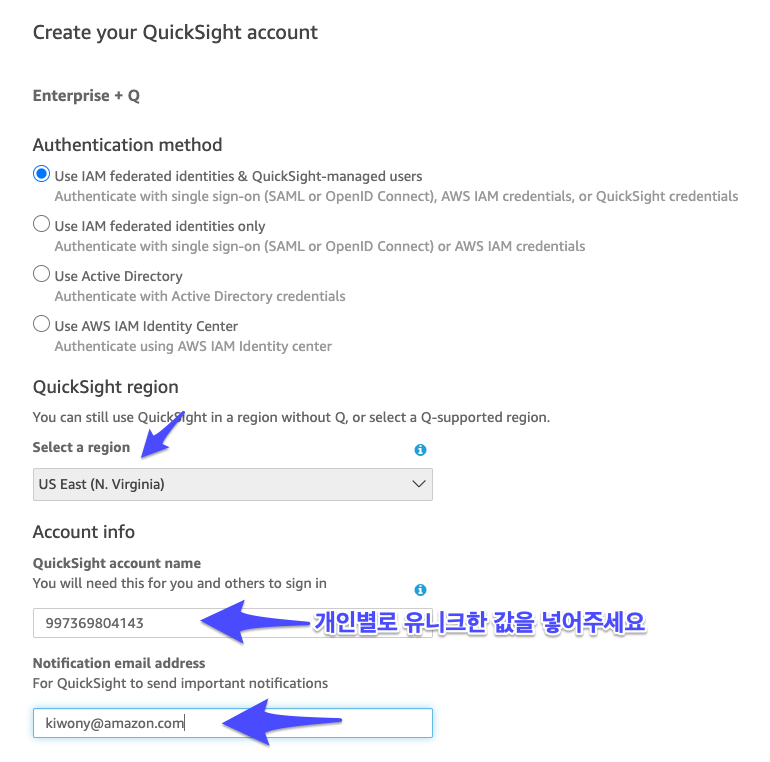
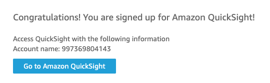
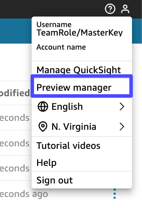
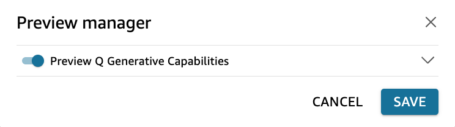

# QuickSight GENBI TF 계정 사용법


---

### QuickSight 계정 생성

---

1. Service => QuickSight 로 이동, **Sign up for QuickSight** Click



---

8. **Enterprise + Q** 선택 후, **Continue** Click




---

9. 모든 개인 정보 항목을 입력합니다.




---

10. **No, Maybe later** Click




---

11. 다음처럼 입력 후 **Finish** Click

```
Region : US East(N. Virginia)
QuickSight Account Name : 유니크한 숫자+문자
Notifcation enamil address : 개인 이메일
```




---

12. **Go to Amazon QuickSight** Click



---

13. **Q Generative** 기능이 활성화 되어 있는지 확인합니다. 만약 Enable이 아니라면 Enable 후 저장합니다.






---

14. 이제 **Aurora MySQL**을 DataSet으로 만들겠습니다.


---

[<다음> DataSet 생성](./04.md)


