# QuickSight DataSet 생성 및 연결


---

### DataSet 생성

---

1. **New Dataset** Click, **RDS** 선택


---

2. 다음처럼 입력 후 **Validation** Click 후 , **Create data source** Click

```
Data Source Name : octank-orders
Instance ID : octank
Connection type : Public network
Database Name : octank
Username : admin
password : Octank#1234
```


---

3. **orders** 를 선택 후 **Select** Click

   **Import to SPICE for quicker analytics** 선택 후 **Edit/Preview data** Click

   **SAVE & PUBLISH** Click

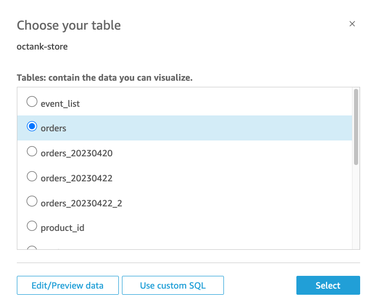

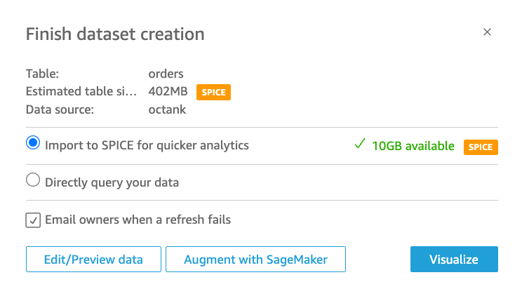

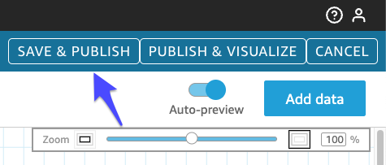

---

4. 두번째 DataSet - **Stores**를 Import합니다. DataSets 메뉴에서 **New dataset** 을 Click

   다음처럼 입력 후 **Validation** Click 후 , **Create data source** Click
   
   **Edit/Preview Data** Click, **Save and publish** Click

```
Data Source Name : octank-store
Instance ID : octank
Connection type : Public network
Database Name : octank
Username : admin
password : Octank#1234
```

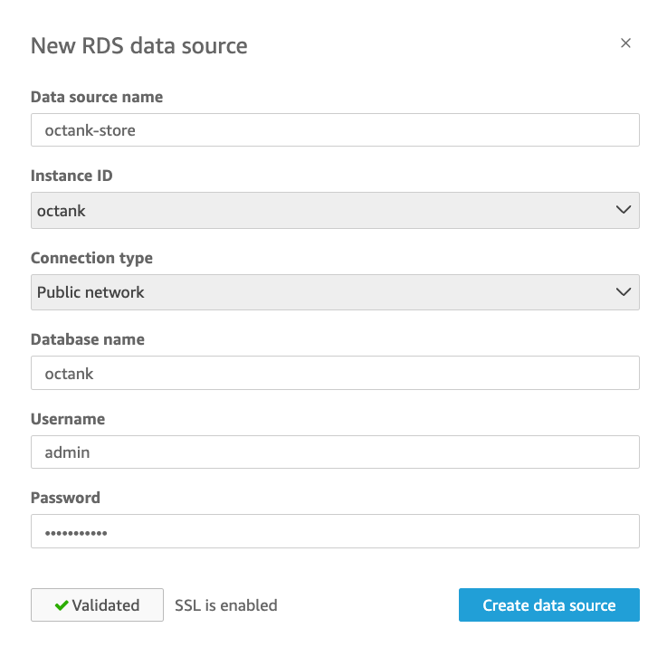

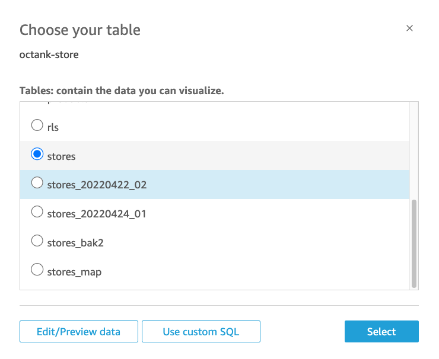

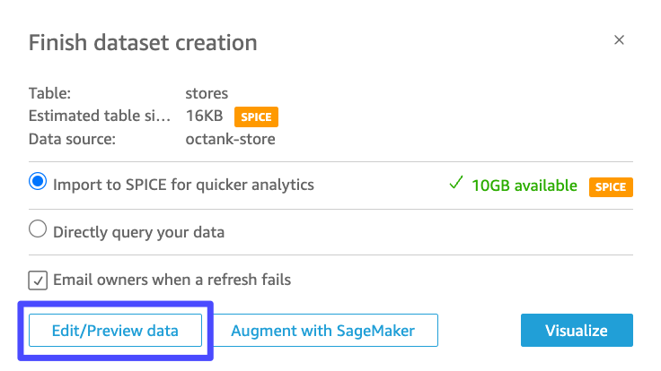


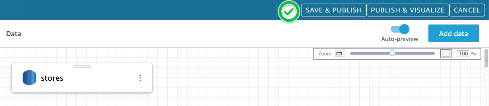


---

5. 세번째 DataSet - **Products**를 Import합니다. 아직 제가 DB에 통합을 못해서 우선 CSV로 공유 드립니다.

   **New Dataset** Click => **Upload a file** Click => 전달 받은 CSV File선택 => **Edit settings and prepare data** Click


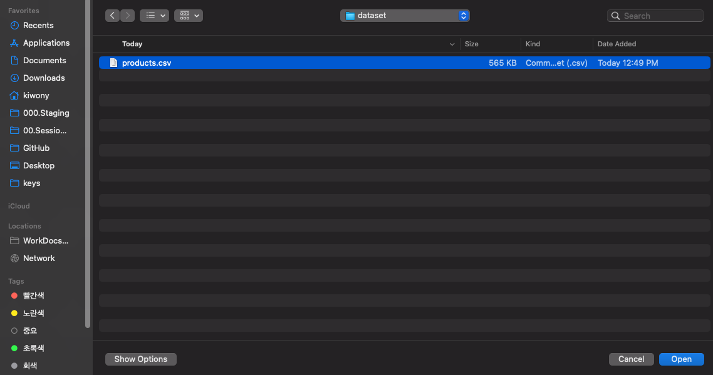

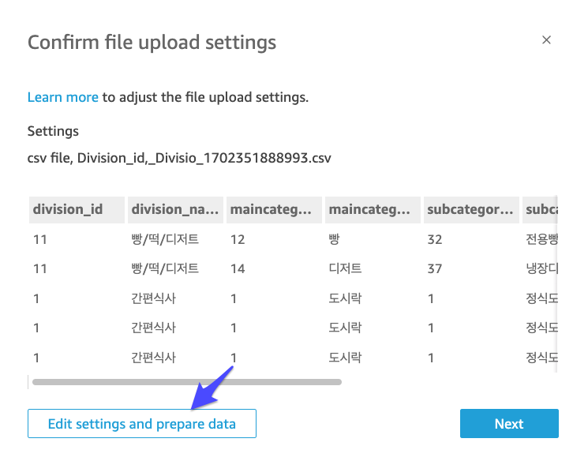

---

6. Column들을 모두 **String**으로 변경합니다. (division_id, maincategory_id, subcategory_id, product_id등)


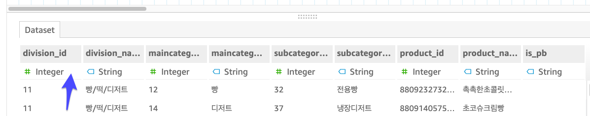

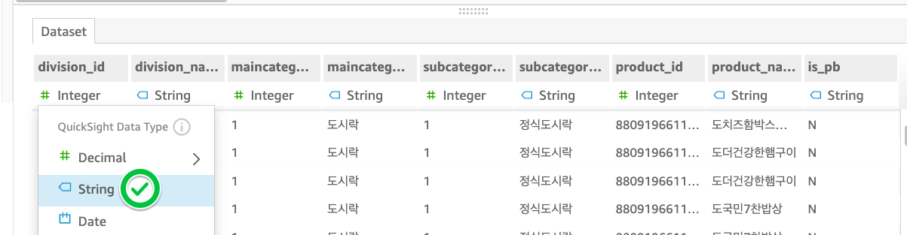

**Column data type 변경 후 **

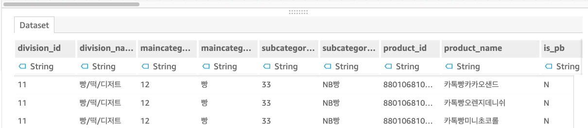


---

7. **Save & Publish** Click


---

8. **orders, stores, proudcts** 를 join한 DataSet을 만듭니다. 아까 만들어둔 **orders** dataset을 Click합니다.

   **Edit DataSet**을 Click합니다.

   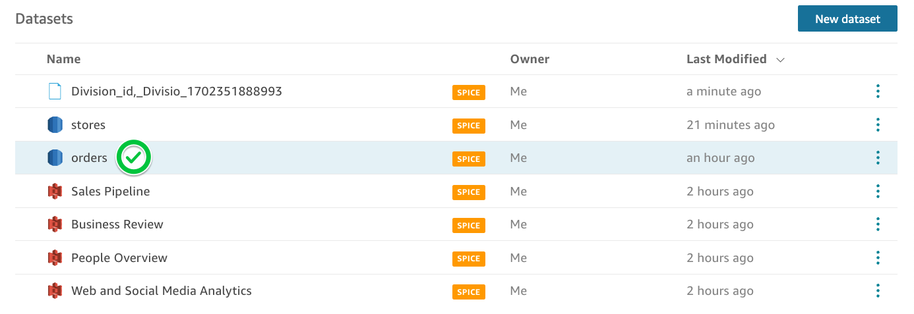

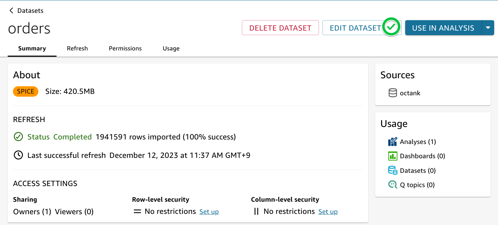

---

9. **Add Data**를 Click하고, **stores** 를 추가 합니다.

   **Left Join**을 선택하고 Join condition에는 **store_id**를 선택합니다.

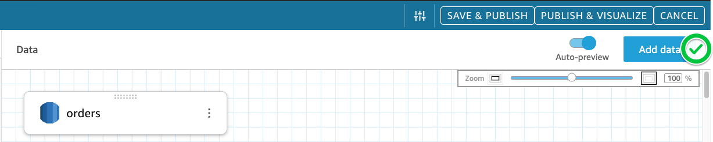

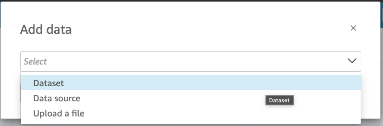


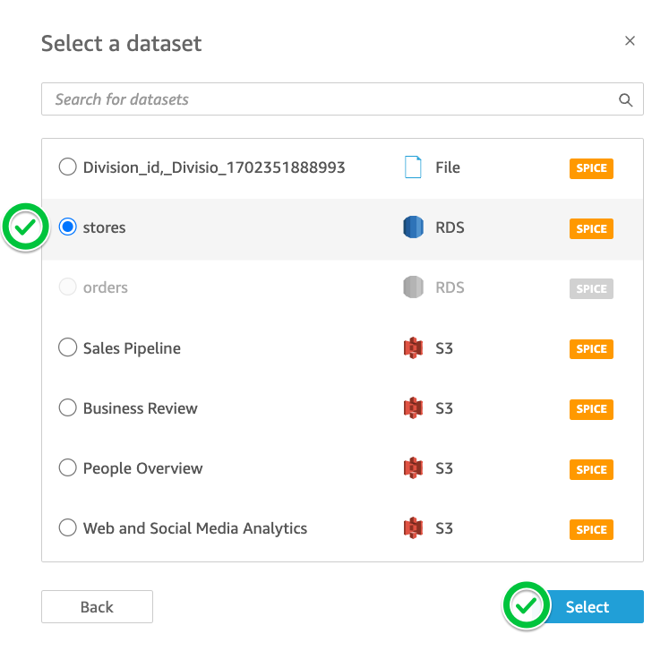

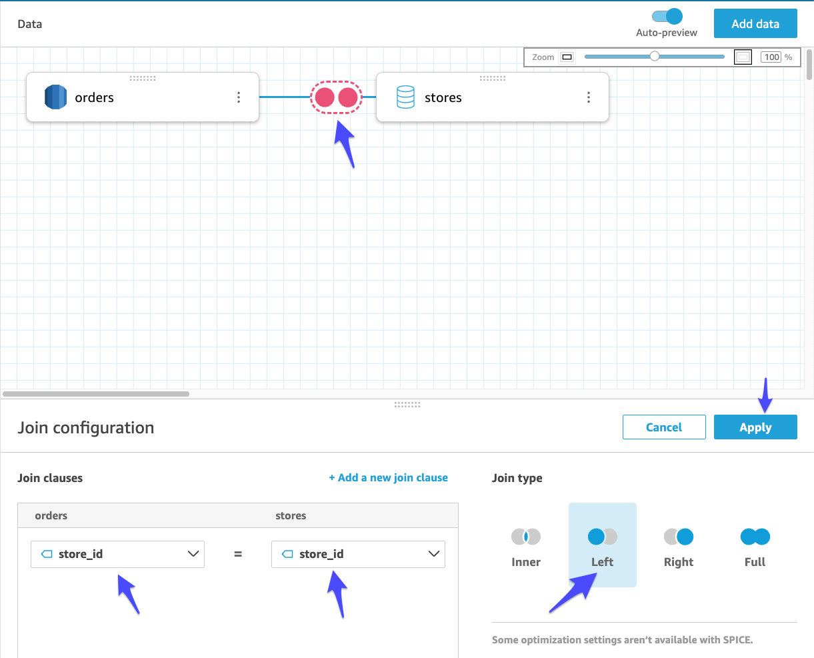


---

10. **Add Data**를 Click하고, **products** 를 추가 합니다.

**Left Join**을 선택하고 Join condition에는 **product_id**를 선택합니다.

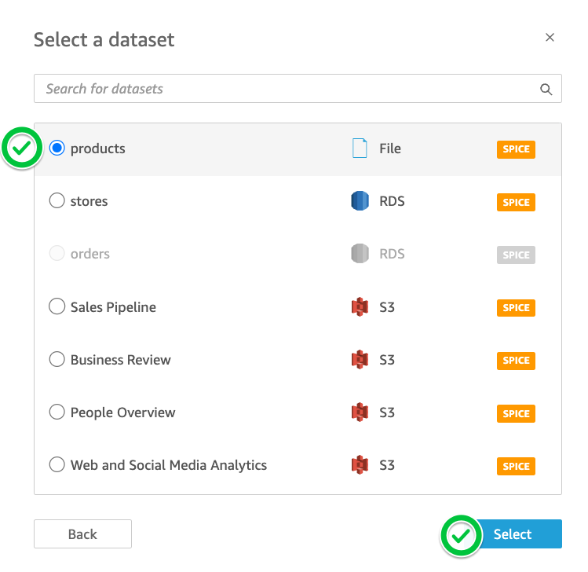


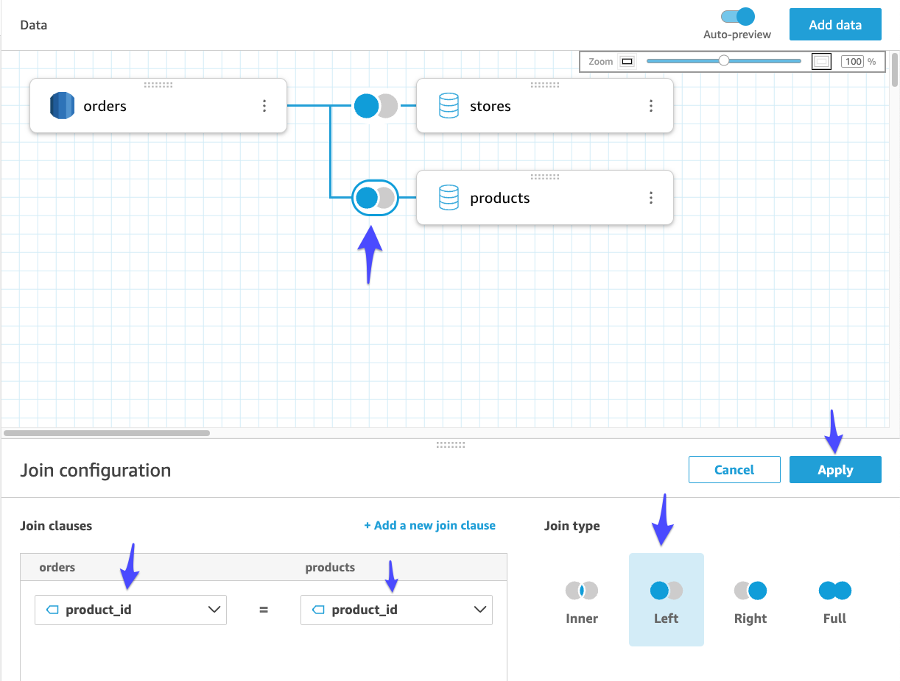


---

11. **Fields**에서 불필요한 중복 칼럼을 Exclude 합니다. (store_id[stores], store_name[stores}, product_id[products]])

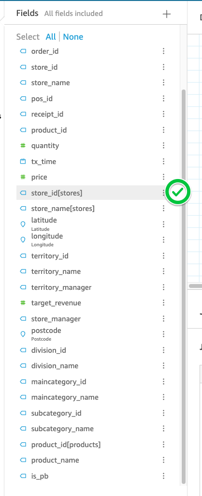

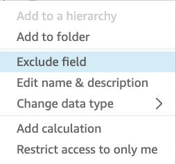


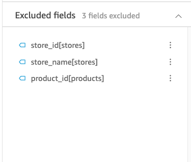


---

12. **Publish & Visualize** Click합니다.


---

13. **New sheet**에서 **Create** Click

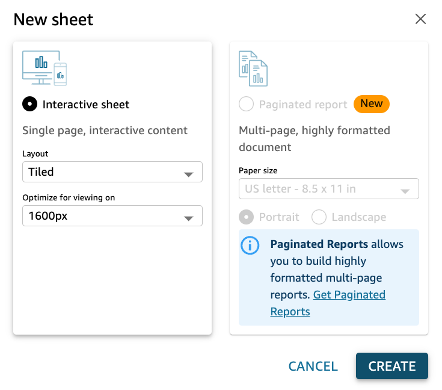

---

[<다음> GEN-BI Test](./05.md)


