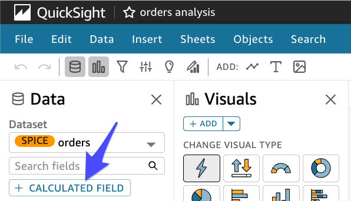
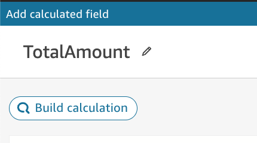
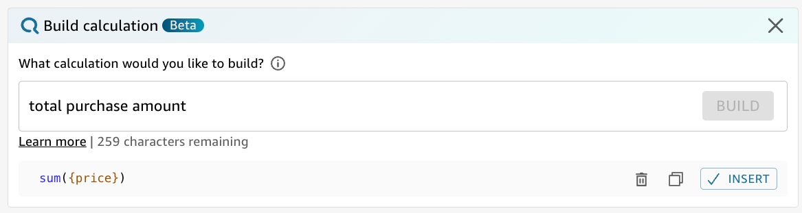
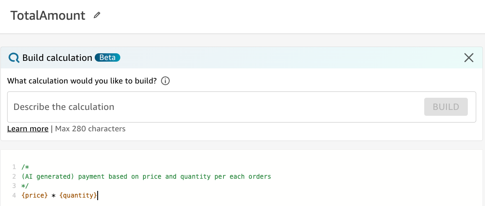
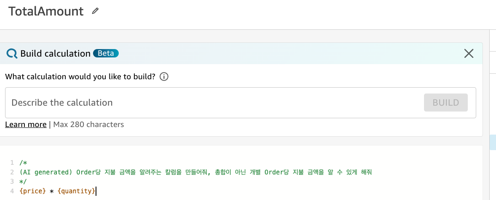
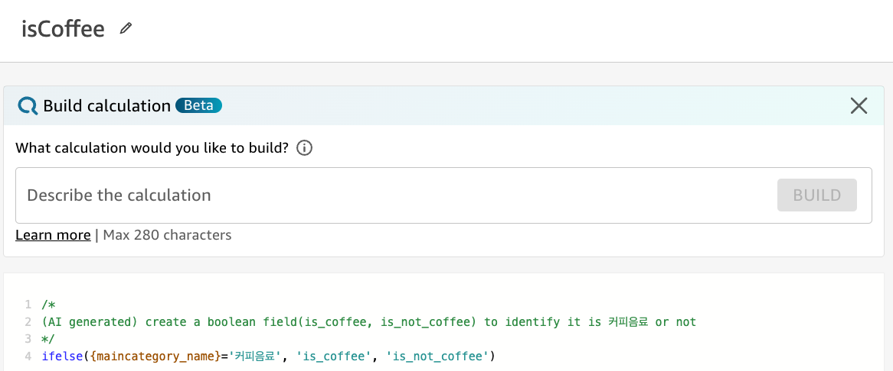
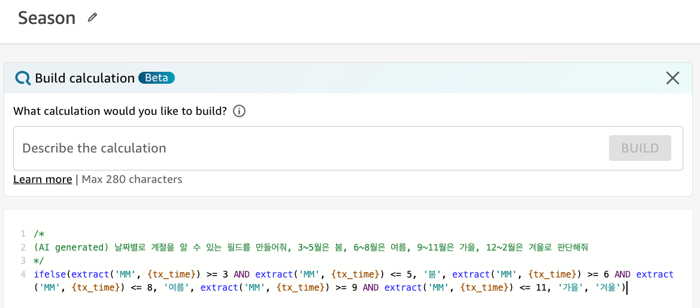

# QuickSight GEN-BI Calculated Field


**참고**

https://docs.aws.amazon.com/quicksight/latest/user/generative-bi-author-experience.html#generative-bi-build-calculations


---

### GEN-BI Calculated Field

---

1. 물품 판매 갯수(quantity)와 가격(price)는 존재하지만, 거래당 매출액이 없습니다. 이를 만들어 보겠습니다.

   **+ CALCULATED FIELD** Click



2. Field 이름을 **TotalAmount**로 넣어주고 **Build calculation** Click



3. **total purchase amount** 라고 넣고 Build를 눌러 봅니다. 저희가 원하는 결과가 안 나오네요.




4. 다음의 다양한 문장을 통해 원하는 결과를 찾아 봅니다. 

```
total sales amount per each transaction
sum({price})/count({tx_time})

total purchase amount per each orders
동작 안함

revenue per each order
동작 안함

payment amount per each orders
동작 안함

price*quantity
{price}*{quantity}

total revenue based on price and quantity per each transaction
sum({price} * {quantity})

revenue based on price and quantity per each transaction
sum({price} * {quantity})

revenue based on price and quantity per each orders
sum({price} * {quantity})

payment based on price and quantity per each orders
{price} * {quantity}

개별 판매(order)당 거래 금액을 알려줘
sum({price})

Order당 지불 금액을 알려주는 칼럼을 만들어줘
sum({price} * {quantity})

Order당 지불 금액을 알려주는 칼럼을 만들어줘, 총합이 아닌 개별 Order당 지불 금액을 알 수 있게 해줘
{price} * {quantity}

개별 거래당 사용자가 지불했던 금액을 알 수 있는 필드를 만들어줘
sum({price})/count({tx_time})
```

좀 더 상세하게 기술할 수록 정확한 결과를 만들어 줄 수 있고 한글도 인식합니다.







---

제품별로 구분 할 수 있는 Field를 만들어 보겠습니다.

```
create a field to identify it is coffee or not 
ifelse({maincategory_name} = 'Coffee', 'Yes', 'No')

create a field to identify it is 커피음료 or not 
ifelse(contains({maincategory_name}, '커피'), '커피음료', '그외음료')

create a boolean field to identify it is 커피음료 or not 
ifelse({maincategory_name} = '커피음료', TRUE, FALSE)

create a boolean field(is_coffee, is_not_coffee) to identify it is 커피음료 or not 
ifelse({maincategory_name}='커피음료', 'is_coffee', 'is_not_coffee')

판매된 제품이 coffee인지 아닌지 구분 할 수 있는 필드를 만들어줘
ifelse({product_name}='coffee','is_coffee','not_coffee'

판매된 제품이 "커피음료"인지 아닌지 구분 할 수 있는 필드를 만들어줘
ifelse({product_name}='커피음료', '커피음료', '기타제품')

판매된 제품이 "커피음료"인지 아닌지 구분 할 수 있는 필드를 만들어줘, true조건은 is_coffee로, false조건은 is_not_coffee로 해줘
ifelse({maincategory_name}="커피음료",'is_coffee','is_not_coffee')

판매된 제품이 "간편식사"인지 여부를 알려주는 필드를 만들어줘
ifelse({maincategory_name}="간편식사", 1, 0)
```




---


### Season Column ADD

```
날짜별로 계절을 알 수 있는 필드를 만들어줘, 3~5월은 봄, 6~8월은 여름, 9~11월은 가을, 12~2월은 겨울로 판단해줘
ifelse(extract('MM', {tx_time}) >= 3 AND extract('MM', {tx_time}) <= 5, '봄', extract('MM', {tx_time}) >= 6 AND extract('MM', {tx_time}) <= 8, '여름', extract('MM', {tx_time}) >= 9 AND extract('MM', {tx_time}) <= 11, '가을', '겨울')


```




```
create a field to describe season, March~May=Spring, June~August=Summer, September~November=August, December~Feburary=Winter
```


---

### YoY Sales Growth

```
전년 대비 동월 매출 증가율을 알 수 있는 Field를 만들어줘
실패 
```


---

[<다음> GEN-BI Build Visual](./06.md)

