# QuickSight GEN-BI Preparation - Enabling Q Topic


---

### GEN-BI Build Visual Prepartion - Enabling Q Topic

---

1. **Build Visual** Click

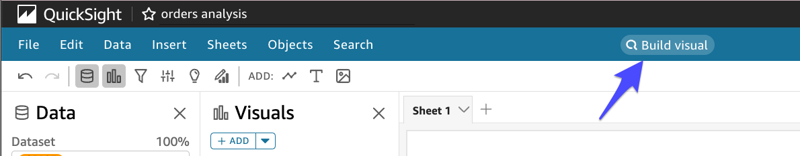


---

2. **Create new topic** 

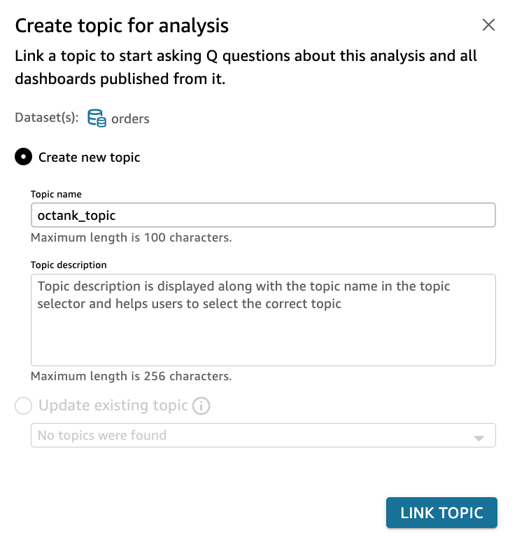


---

3. **Q Topic 생성**을 기다립니다. **Preparing topic**을 누르면 진행 상태를 알 수 있습니다.

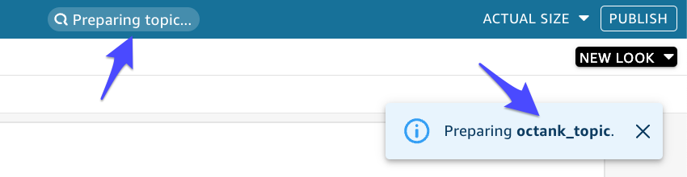


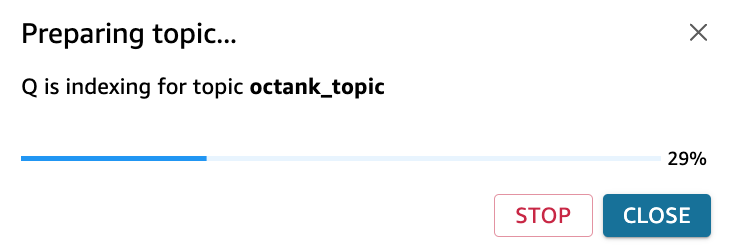


---

4. **Build Visual 옆의 설정**을 누릅니다. **GO To TOPIC**을 Click

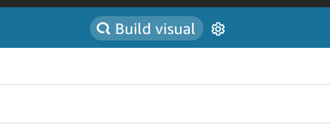


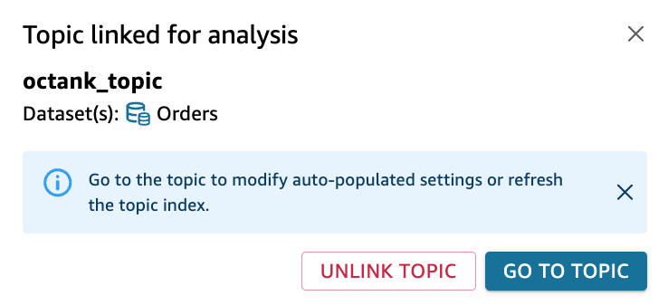

---

5. **Start Review** Click


---

6. 필요한 Column들을 Include하고 필요시 Synonyms를 설정합니다. **Start** Click 후 TIP을 Next로 확인

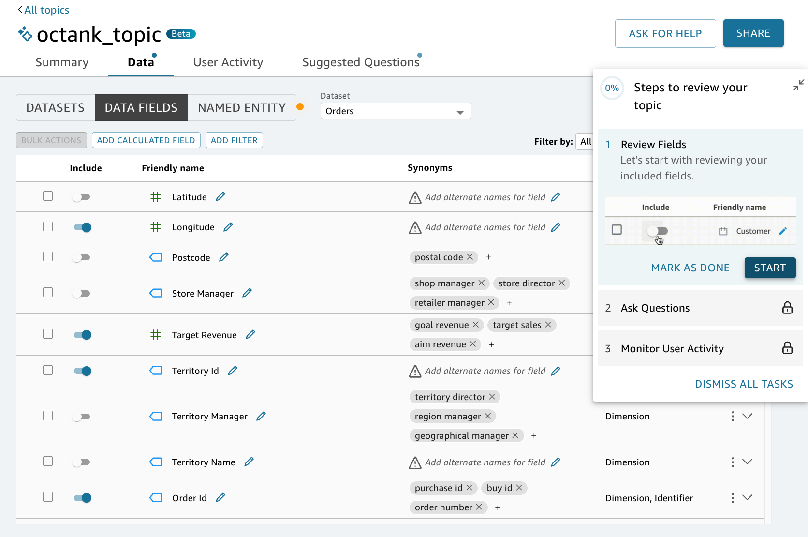


---

7. 전체 Field가 다 보이지 않을 경우 **DATASETS, DATA FIELDS, NAMED ENTITY**를 번갈아 Click하면 모두 보임.

   필요한 Field들을 Include처리(우리는 모든 Field를 Include) 후 **Done** Click

   

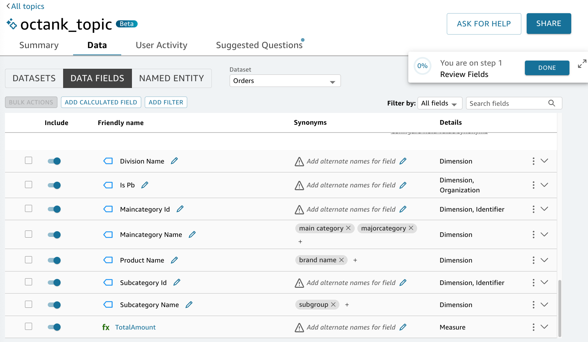


---

8. **Ask Questions**는 **Mark as Done**합니다.
9. **Monitor User Activity** 도 **Mark as Done** 합니다.
10. **Set Up Reviewed Questions**도 **Mark as Done** 합니다.
11. **CLOSE** Click

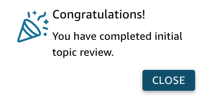


---


12. **Suggested Questions** Click 후 **AI GENERATED**를 Click해봅니다.

    관심 있는 질문들을 눌러 봅시다. 아쉽게도 쓸만한 질문이 없네요. 다음에는 Field를 잘 선택해야겠습니다.


---

13. **what are the top 5 product ids by total quantity?** 를 골라봤습니다.

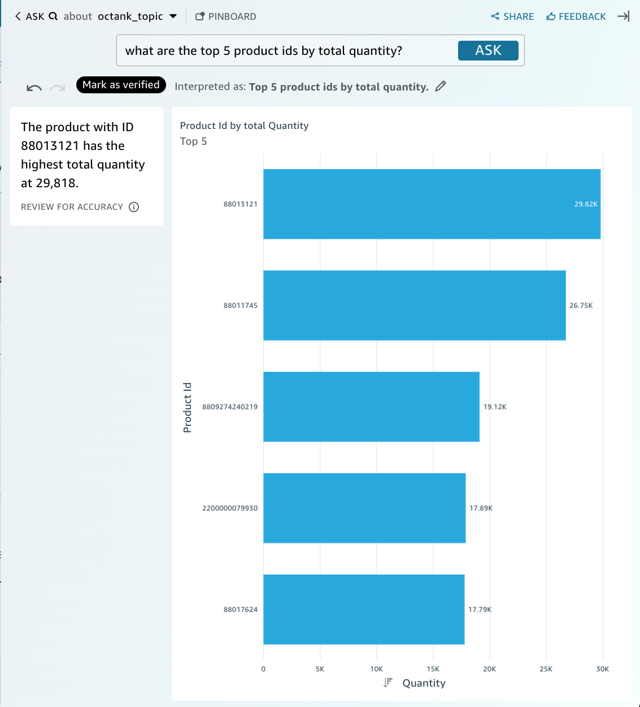


---

14. 위에서는 ID로 나오니 보기 어렵네요, 질문에서 **Product ID** 대신 **Product Name**으로 바꿔서 질문을 해보겠습니다.

    **what are the top 5 product name by total quantity?**

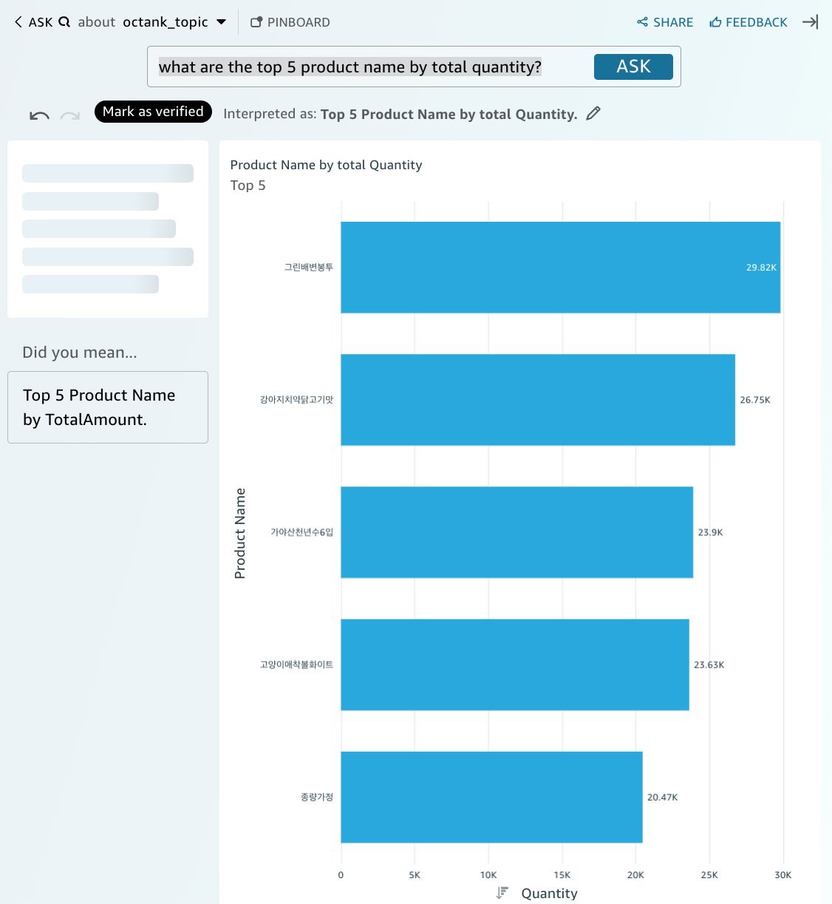


---

15. 한국어로 바꿔서 질문 해볼까요? 잘되지 않습니다.

    ```
    총 판매 기준 상위 5개 제품명은 무엇인가요? 
    
    ```


---

16. Topic Building은 시간이 좀 걸립니다.

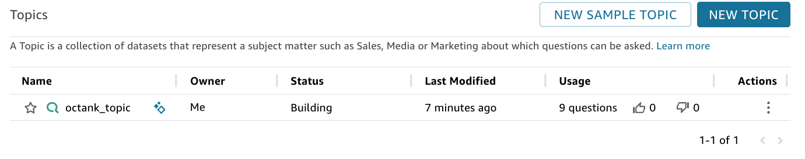


---

[<다음> GEN-BI Build Visual](./07.md)


