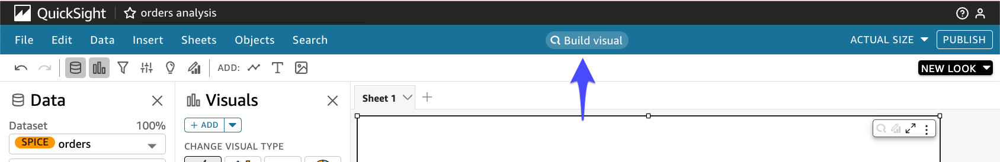

# QuickSight GEN-BI Build Visual

---

### GEN-BI Build Visual 

---

1. 아까 생성한 Analysis로 이동 후 **orders analysis** 를 선택합니다.

   https://us-east-1.quicksight.aws.amazon.com/sn/start/analyses

---

2. **Build Visual**을 Click

---

3. **Show me top 5 product name by totalamount** 로 질문해봅니다. **ADD TO ANALYSIS** 를 Click하여 추가합니다.

---

4. **Show me top 5 product name by quantity** 로 질문해봅니다. **ADD TO ANALYSIS** 를 Click하여 추가합니다.

---

5. 

---

6. **show me sales ratio per store name** 

---

7. **show me product name=냉동면**

---

8. Q Topic 일부 Disable 및 re-indexing

---

9. 동작 안함

---

10. **"간편식사" list** => 동작안함.

---

11. **product name where division name "간편식사" **

---

12. **product name where division name is "간편식사" **

---

13. **product name where division id is 34** , ID는 잘 동작함.

---

14. **show me division id that division name is 음료주류선물세트**

---

15. **show me sales difference between Feb-2020 and Feb-2021**

---

[<다음> GEN-BI Storyl](./08.md)

