# QuickSight GEN-BI Build Story

---

### GEN-BI Build Story

---

1. **Publish**

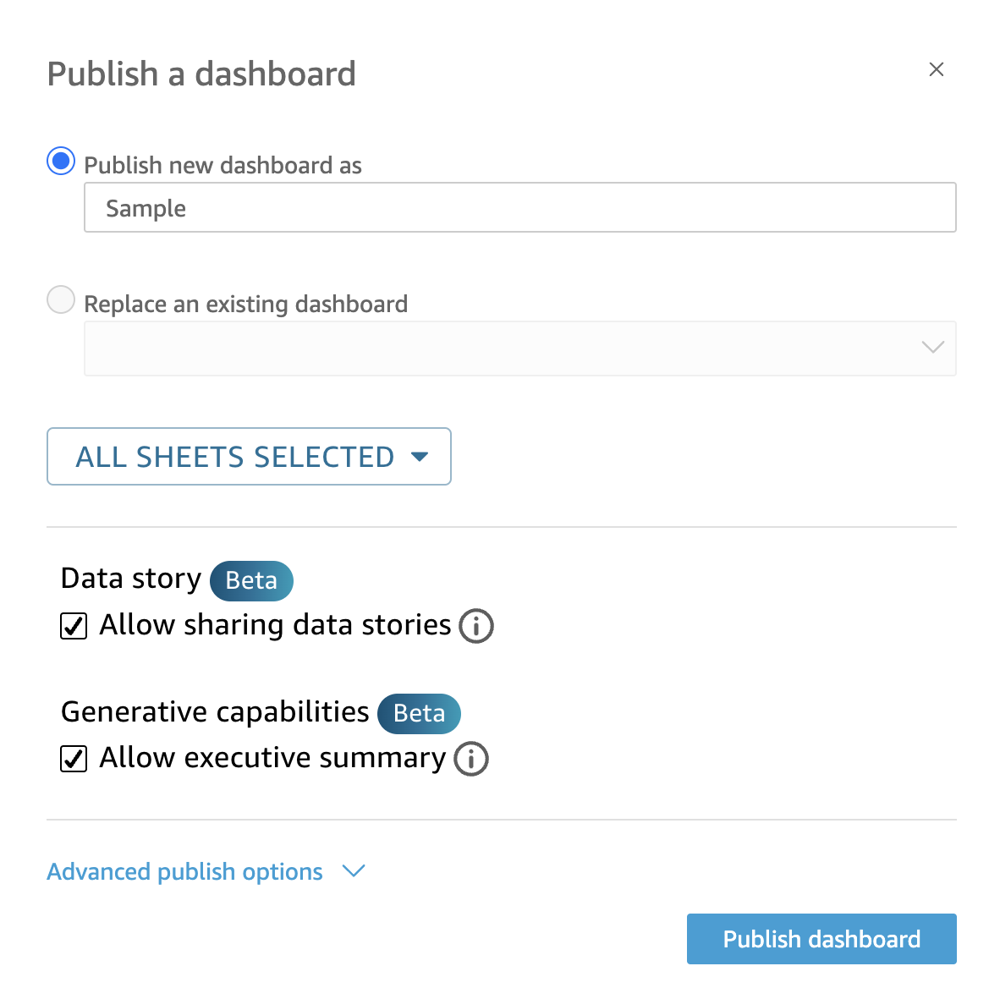

---

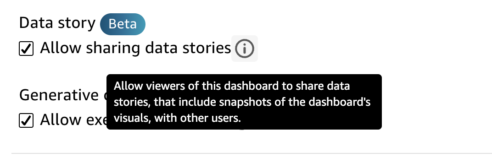

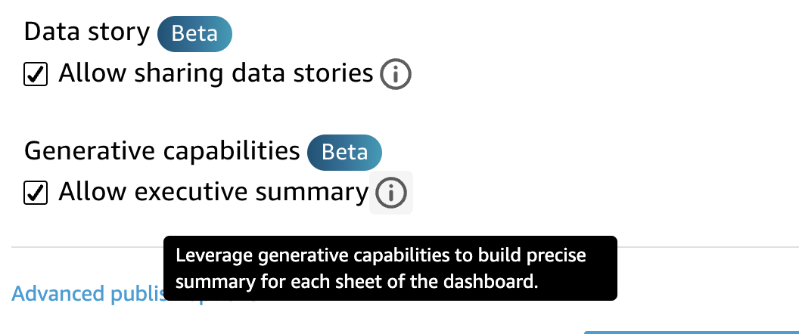

---

2. **Build Summary** => **Executive summary** => **Summarize** 

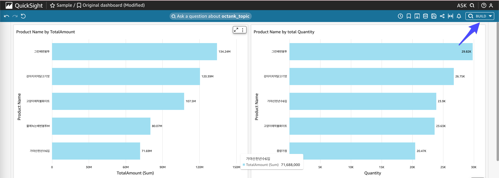

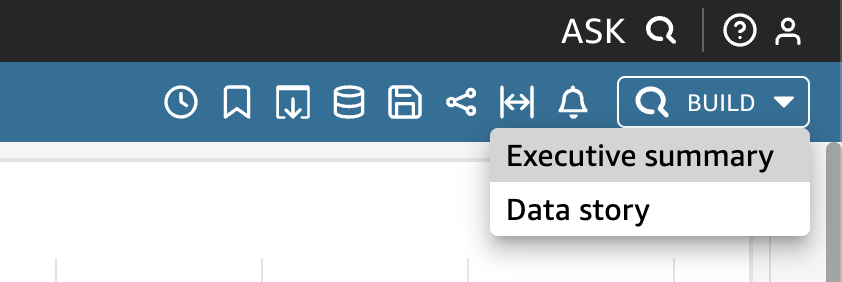

---

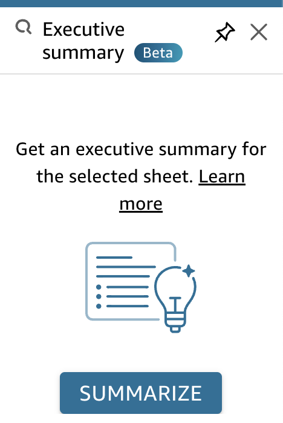

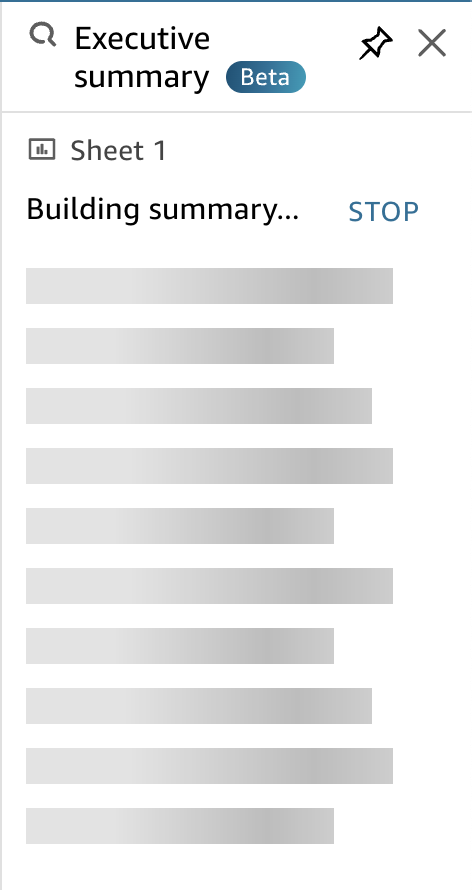

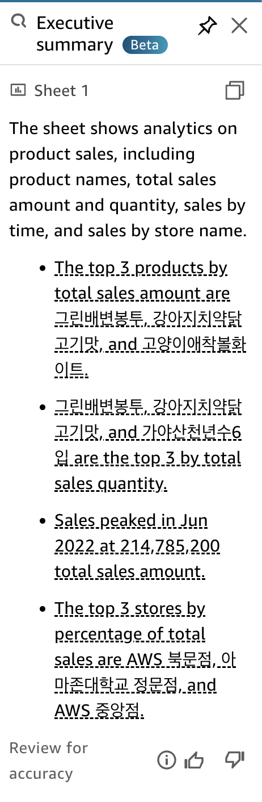

---

3. **Build Data Story**

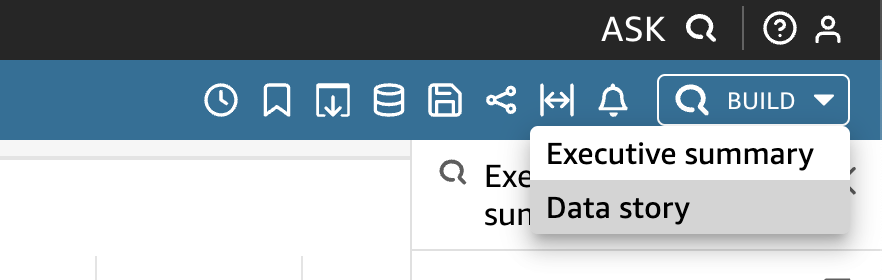

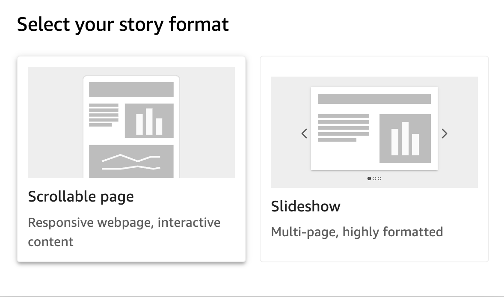

4. **build a store about sales changes based on season**

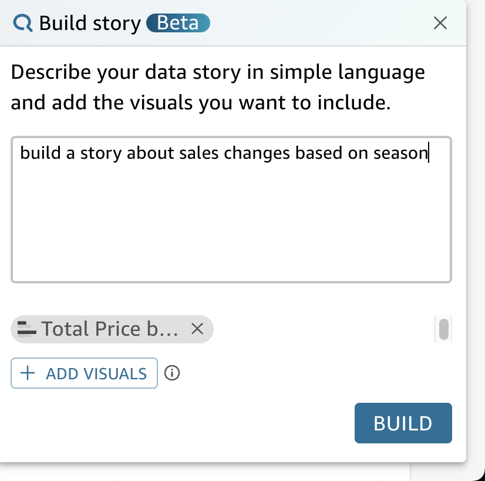

---

5. **계절 별 아이스크림 판매 변화량**  **build a story about icecream sales changes based on season**

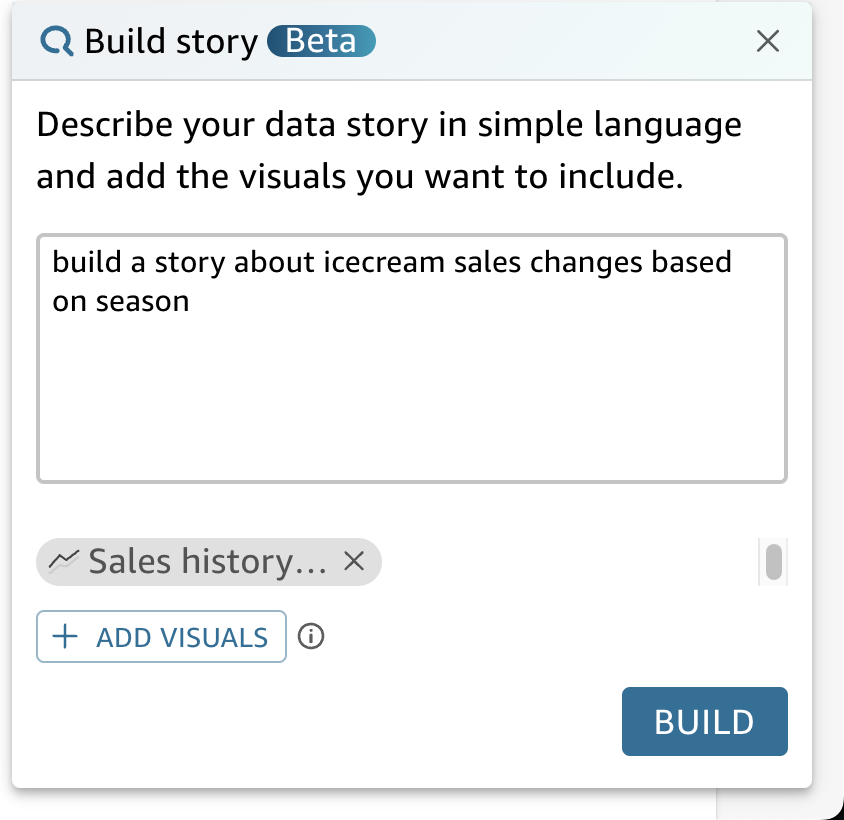

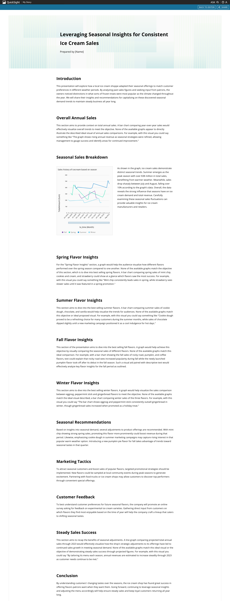

