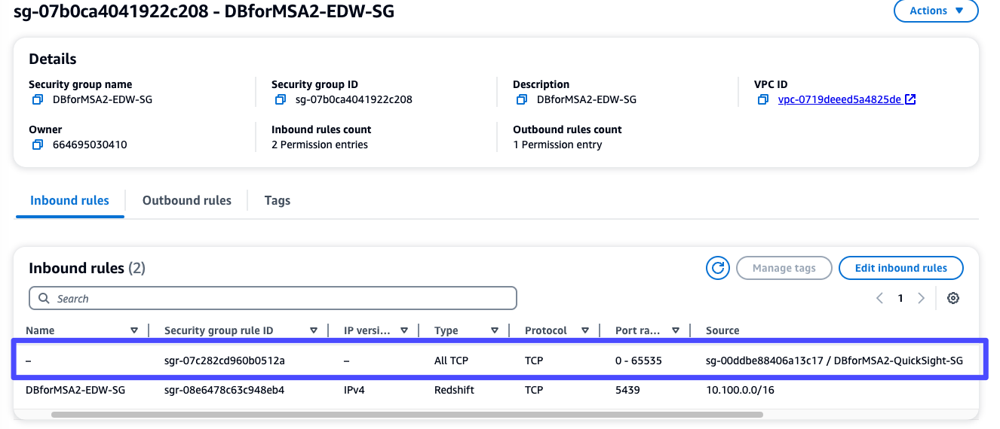

# Redshift Private Network Connection

1. Create Redshift Security Group

---

2. Create QuickSight SG

---

3. Create Redshift Subnet

---

4. Add subnet

---

5. Create Cluster

---

6. 

---

7. Manage QuickSight

---

8. Manage VPC connections

---

9. 

---

10. 

---

11. sg-010598e2b46e64761

---

12. Redshift Security group에 QS security Group Inbound추가

---

13. Status 변경 확인

---

14. Create DataSet

---

15. EDW-Redshift-Sales

---

16. Sales Table

---

17. EDW-Redshift-Users

---

18. EDW-Redshift-Dates

---

19. Visualize

