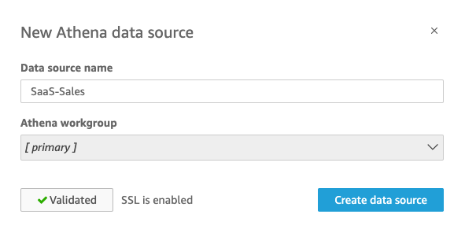
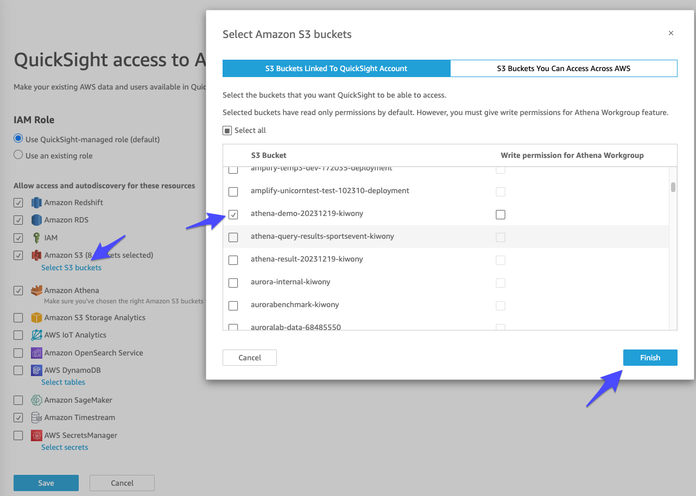

# Athena Connection

1. Create Bucket

```
kiwony@kiwonymac.com:/Users/kiwony> aws s3 mb s3://athena-demo-20231219-kiwony
make_bucket: athena-demo-20231219-kiwony
```


---

2. Upload SaaS-Sales-H1.csv into S3

```
kiwony@kiwonymac.com:/Users/kiwony/Documents/GitHub/Quicksight/20231219.RDS.Redshift.PrivateConnect> aws s3 cp SaaS-Sales-H1.csv s3://athena-demo-20231219-kiwony
upload: ./SaaS-Sales-H1.csv to s3://athena-demo-20231219-kiwony/SaaS-Sales-H1.csv

kiwony@kiwonymac.com:/Users/kiwony/Documents/GitHub/Quicksight/20231219.RDS.Redshift.PrivateConnect> aws s3 ls s3://athena-demo-20231219-kiwony
2023-12-19 23:34:12     864747 SaaS-Sales-H1.csv
```


---

3. Create Glue Database


---

4. Crawling Metadata


---


---


---


---


---


---


---

5. Run Crawler


---

6. Check Metadata


---

7. View Data


---

8. Run Sample Query


---

9. Run Sample Query2

```
SELECT round(sum(sales)) as "Sales-Total", country FROM "AwsDataCatalog"."athena-demo-20231219"."athena_demo_20231219_kiwony" group by country order by 1 desc;
```


---

10. Create View


---

11. Query with View


---

12. Create DataSet - Athena


---

13. Check Validation



---

14. Choose table - 우리는 View를 골라 보겠습니다.


---


---

15. S3 Bucket에 대한 권한을 주지 않아서 생기는 문제입니다. 권한을 주겠습니다.


---

16. Security & Permissions


---

17. athena-demo-20231219-kiwony bucket 권한 허용




---

18. 다시 Athena를 DataSet으로 만듭니다. (12~14번 Step)


---

19. Publish 


---

20. 신규 데이터가 들어왔다고 가정해보겠습니다.

```
kiwony@kiwonymac.com:/Users/kiwony/Documents/GitHub/Quicksight/20231219.RDS.Redshift.PrivateConnect> aws s3 cp SaaS-Sales-H2.csv s3://athena-demo-20231219-kiwony
upload: ./SaaS-Sales-H2.csv to s3://athena-demo-20231219-kiwony/SaaS-Sales-H2.csv

kiwony@kiwonymac.com:/Users/kiwony/Documents/GitHub/Quicksight/20231219.RDS.Redshift.PrivateConnect> aws s3 ls s3://athena-demo-20231219-kiwony
                           PRE query_result/
2023-12-19 23:34:12     864747 SaaS-Sales-H1.csv
2023-12-20 00:00:06     865793 SaaS-Sales-H2.csv
```


---

21. Athena에서 동일한 View를 조회해보겠습니다. 신규 데이터가 정상적으로 바로 조회되는 것을 볼 수 있습니다.


---

22. QuickSight를 새로 고침 해보겠습니다. 정상적으로 반영된 것을 볼 수 있습니다.


