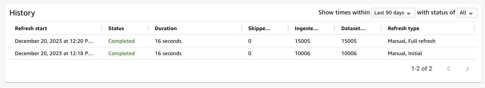

# S3 Manifest

1. Create S3 bucket & upload file

```
kiwony@kiwonymac.com:/Users/kiwony/Documents/GitHub/Quicksight/20231219.RDS.Redshift.PrivateConnect> aws s3 cp SaaS-Sales.csv s3://s3-quicksight-20231219-kiwony
upload: ./SaaS-Sales.csv to s3://s3-quicksight-20231219-kiwony/SaaS-Sales.csv

```


---

2. Create manifest file & Upload

```
{
  "fileLocations": [
    {
      "URIPrefixes": [
        "s3://s3-quicksight-20231219-kiwony/"
      ]
    }
  ],
  "globalUploadSettings": {
    "format": "CSV"
  }
}

```


```
kiwony@kiwonymac.com:/Users/kiwony/Documents/GitHub/Quicksight/20231219.RDS.Redshift.PrivateConnect> aws s3 cp s3-manifest.json s3://s3-quicksight-20231219-kiwony
upload: ./s3-manifest.json to s3://s3-quicksight-20231219-kiwony/s3-manifest.json
```


---

3. Upload 시도


---

4. S3 접근 권한 설정


---

5. 


---

6. 


---

7. 시각화


---

8. 

```
kiwony@kiwonymac.com:/Users/kiwony/Documents/GitHub/Quicksight/20231219.RDS.Redshift.PrivateConnect> aws s3 cp SaaS-Sales-H1.csv  s3://s3-quicksight-20231219-kiwony
upload: ./SaaS-Sales-H1.csv to s3://s3-quicksight-20231219-kiwony/SaaS-Sales-H1.csv

kiwony@kiwonymac.com:/Users/kiwony/Documents/GitHub/Quicksight/20231219.RDS.Redshift.PrivateConnect> aws s3 ls s3://s3-quicksight-20231219-kiwony
2023-12-20 12:20:18     864747 SaaS-Sales-H1.csv
2023-12-20 12:09:40    1730540 SaaS-Sales.csv
2023-12-20 12:13:50        172 s3-manifest.json

```


---

9. DataSet Refresh




---

10. Refreshed QS


