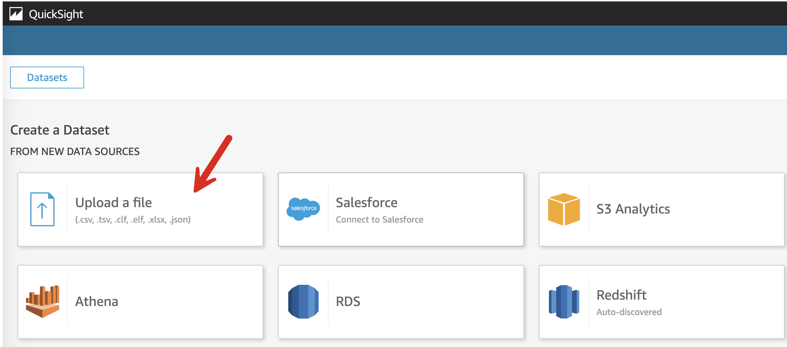

# QuickSight DataSet 생성

---

### QuickSight DataSet 생성

---

1. [다운로드 ](https://shared-kiwony.s3.ap-northeast-2.amazonaws.com/LoanDefualtsData-train.csv) 를 눌러서 CSV Data File을 다운로드 합니다.

---

2. [여기](https://us-east-1.quicksight.aws.amazon.com/sn/data-sets/new) 를 새 창(새 탭)으로 띄워서 **DataSet 생성**으로 이동합니다.

<a href="https://us-east-1.quicksight.aws.amazon.com/sn/data-sets/new" target="_blank" rel="noopener noreferrer">여기</a>

---

2. **Upload a file** Click

---

3. 

