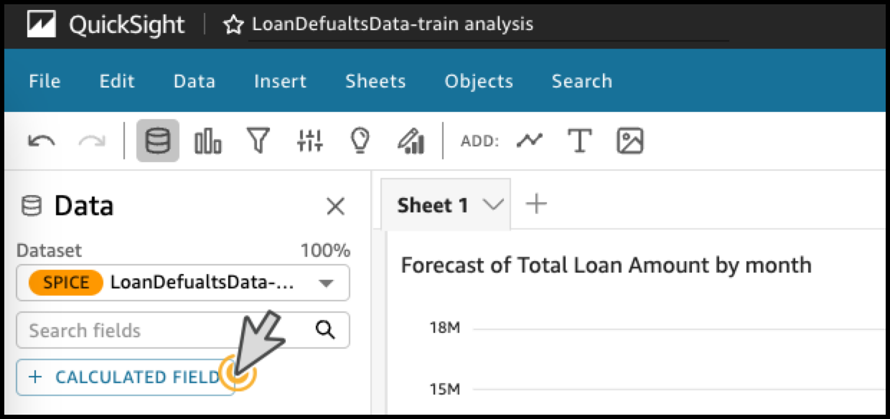
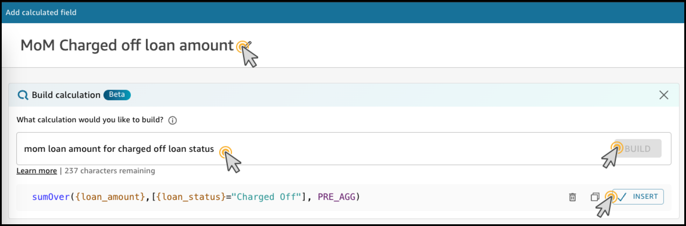
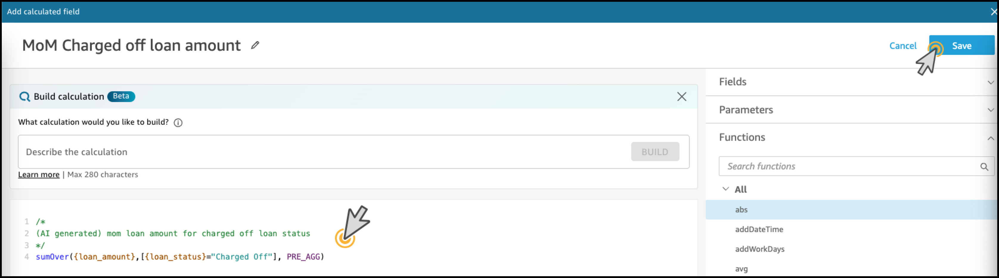
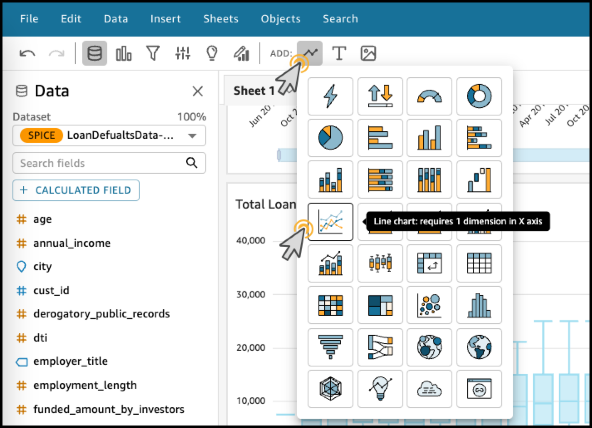
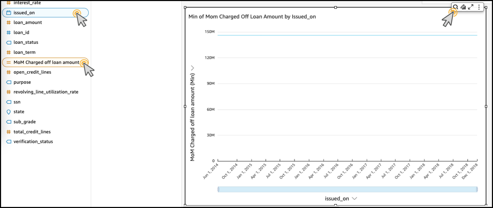
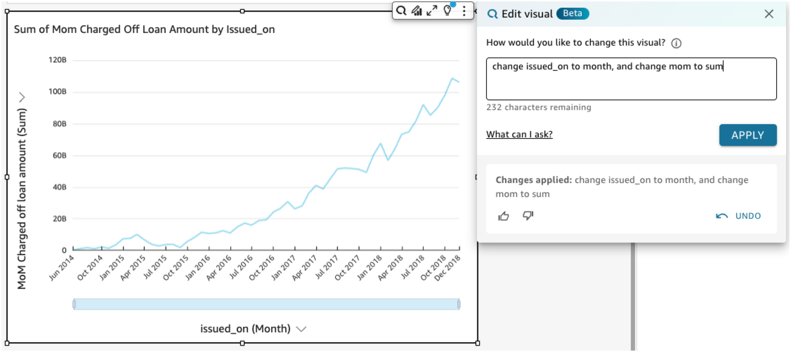

# 계산된 Field 생성 

---

### 계산된 Field 생성 

---

1. 화면 좌측의 **CALCULATED FIELD** Click

---

2. 불량 채권의 변화량을 알기 위한 새로운 Field를 추가하겠습니다.

   **Add name** 부분에 `MoM Charged off loan amount` 입력

   **Build Calculation** Click 후 원하는 계산식을 입력. - `mom loan amount for charged off loan status` 입력 후 **Build** Click
   
   **Insert** Click

---

3. 계산된 결과를 확인 후 **Save** Click

---

4. 방금 추가한 계산된 Field를 사용하여 **불량 채권의 변화량**를 살펴보겠습니다.

   Visual을 하나 추가합니다, Line Chart를 선택합니다.

---

5. **issued_on** 과 **MoM Charged off loan amount** Field를 선택합니다.

   **Edit with Q** Click 후 `change issued_on to month, and change mom to sum` 을 입력 후 **APPLY** Click

   

---

[<다음> 보고서 작성](./05.md)

