# 보고서 작성

---

### 보고서 작성 

---

1. Dashboard를 만들기 위해서 우측 상단의 **PUBLISH** Click

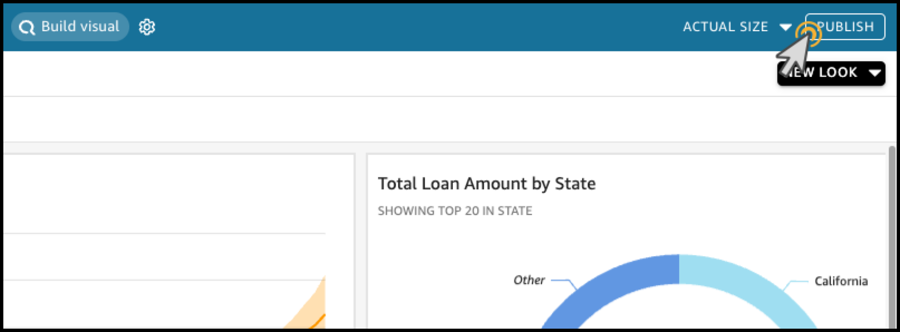

---

2. **Publish new dashboard as** 에 `Loan Report` 입력 

**Generative capabilities** 아래의 **Allow executive summary** Check

**Publish dashboard** Click

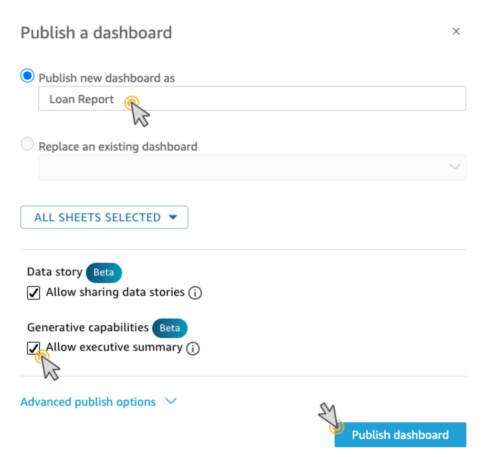

---

3. 우측 상단의 **Build** Click 후 **Executive summary** Click

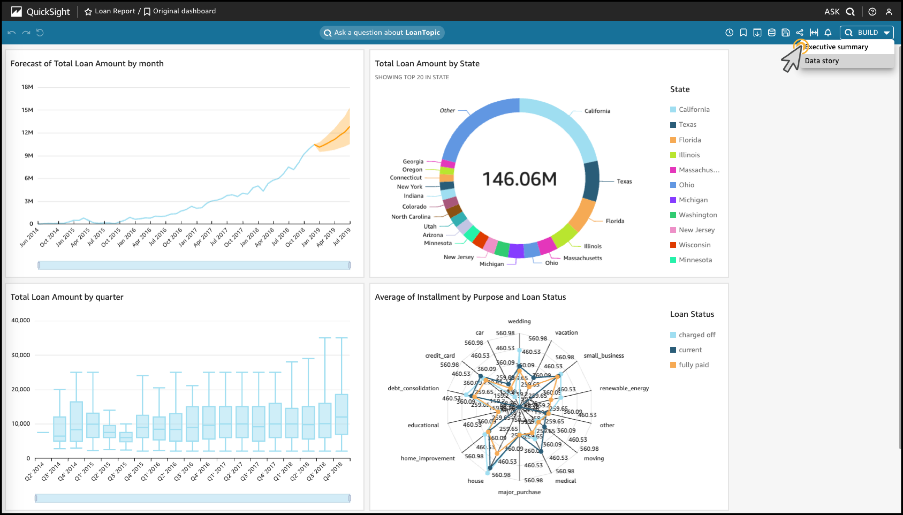

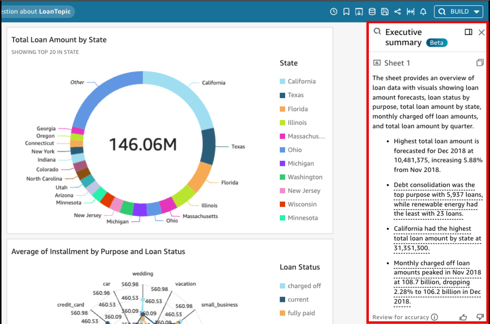

---

4. 우측 상단의 **Build** Click 후 **Data Story** Click

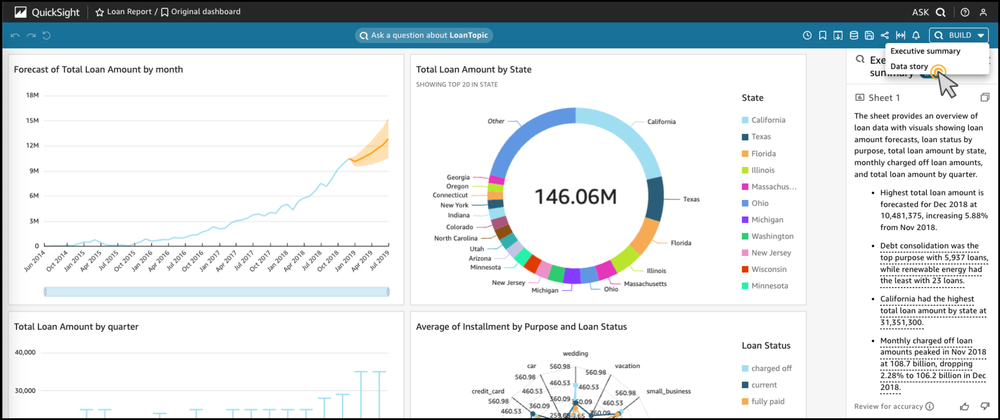

---

5. Story Format을 선택합니다. **Scrollable page**를 선택하겠습니다.

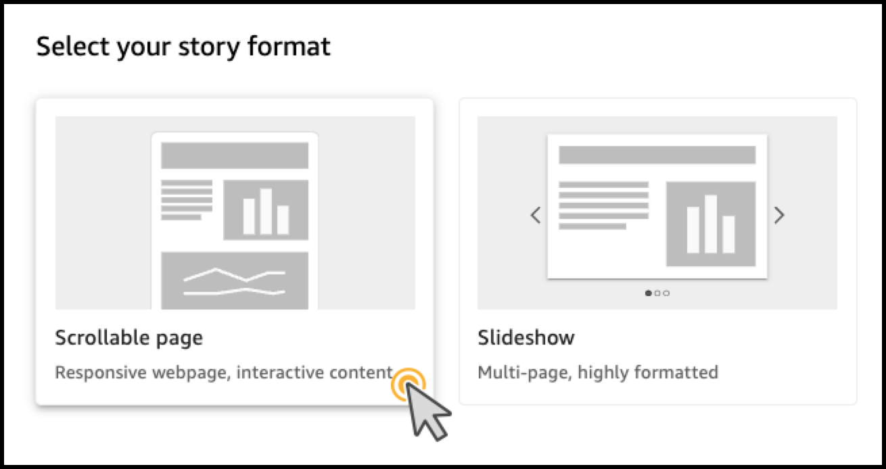

---

6. 보고서 작성을 원하는 Visual들을 추가합니다. **Visuals** 옆의 **+ ADD** Click

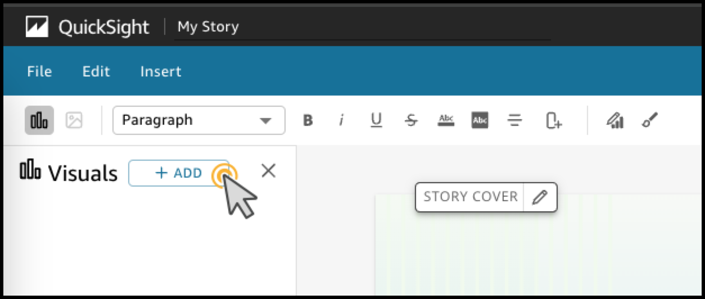

---

7. 모든 Visual들을 선택하고, **ADD** Click

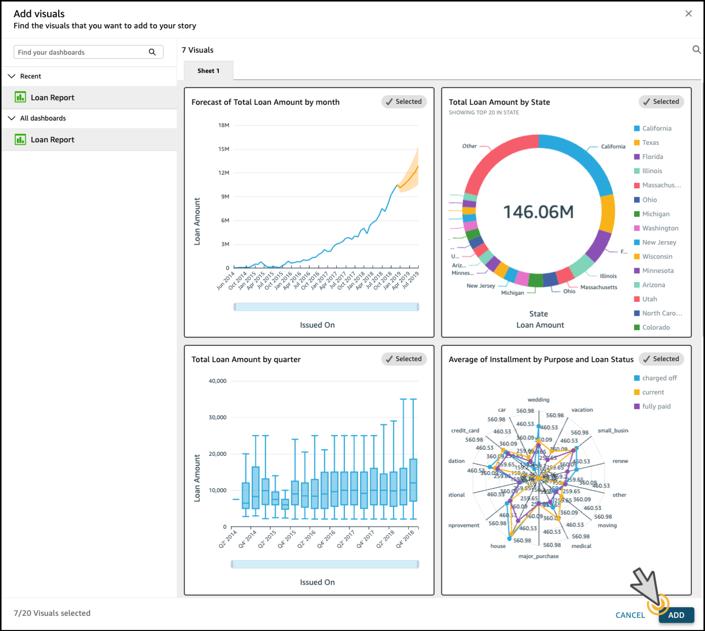

---

8.  `Analyze the increasing trend of loan amounts by quarter and the increasing trend of charged-off cases together` 를 입력 후 **BUILD** Click

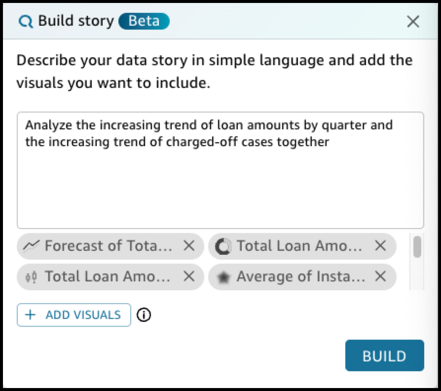

---

9. 작성된 **Data Story** 를 확인합니다.

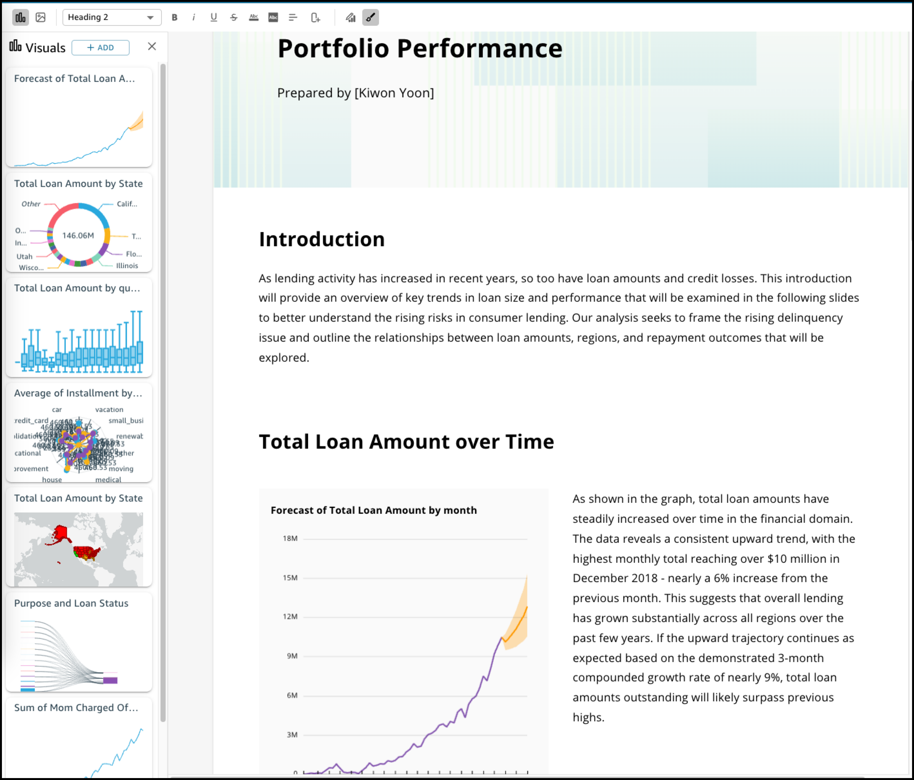

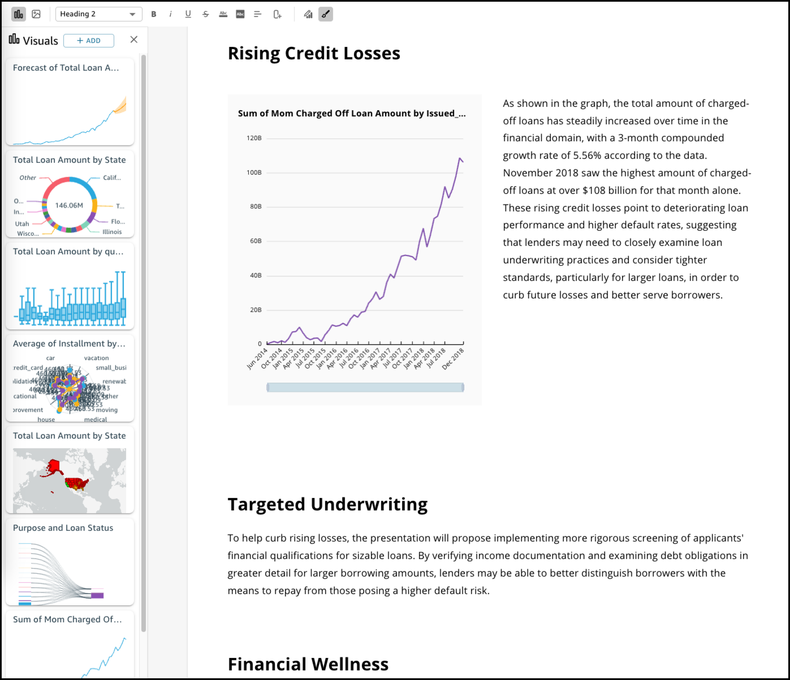

---

