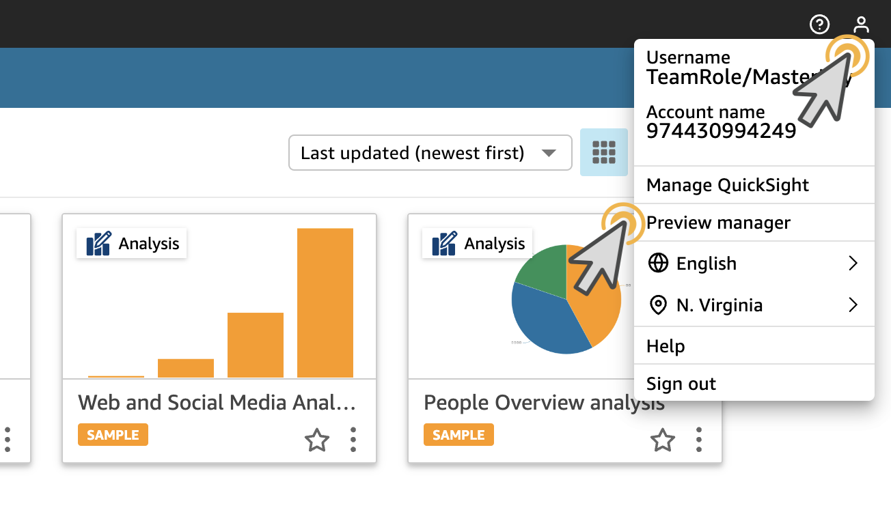

# QuickSight 생성형 BI 기능 활성화

---

### 생성형 BI 기능 활성화

---

1. [여기](https://us-east-1.quicksight.aws.amazon.com/sn/start/analyses) 를 새 창(새 탭)으로 띄워서 **QuickSight Console**로 이동합니다.

---

2. 화면 우측 상단의 사람 모양의 **Profile** 을 선택 후, **Preview manager** 를 Click 합니다.

---

3. **Preview Q Generative Capabilities** 를 **활성화**하고 **SAVE** 를 Click합니다.

---

[<다음> DataSet 생성](./03.md)
