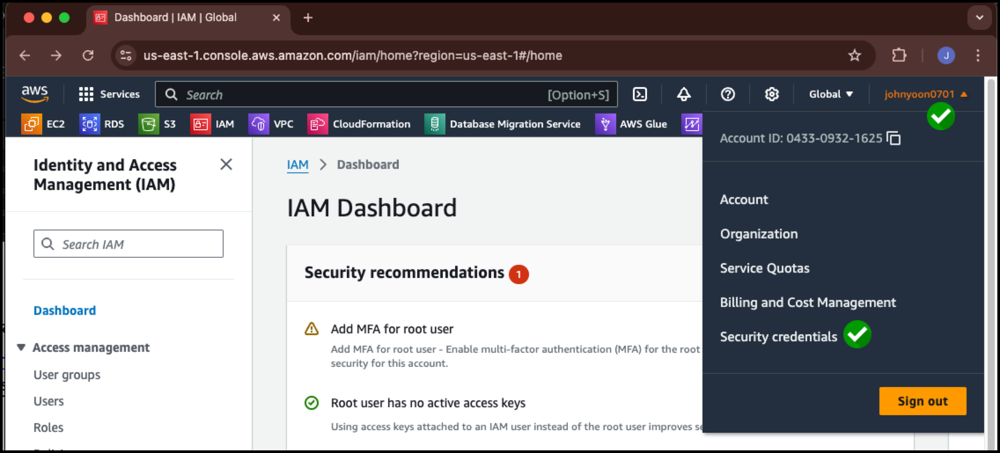

# Root User MFA  설정 방법 & IAM User 추가 방법

## Root User MFA 설정 방법

1. Console 우측 상단의 사용자 계정 Click 후 Security credntials Click

---

2. **Assign MFA device** Click

---

3. Device Name 입력 후 MFA 인증 수단 선택(기존 사용하던 MFA 방식 선택)

---

4. 아래 순서대로 작업 수행

   원하는 인증 수단을 설치(아래 예제에서는 Authy App사용)

   Show QR Code를 클릭하여 QR 확인

   

---

5. QR을 표시 후 Authy App에서 QR을 촬영 후 Authy App에서 저장

---

6. 저장 후 연속된 MFA 2개를 **3번 Enter a code from your virtual app below**에 입력

---

7. MFA 등록이 되면 아래처럼 화면이 변경 됨.

---

8. 이후 Logout후 다시 Login을 시도하면 Password 입력 다음에 MFA를 확인 받습니다.

---

## IAM 계정 추가 방법

1. IAM Console로 이동합니다.

---

2. Users Click 후 **Create User** Click

---

3. Admin User 이름을 입력합니다.

---

4. **Attach policies directly** 선택 후 **AdministratorAccess**를 선택 후 **Next** Click

---

4. **Create User** Click

---

5. 생성된 Admin User를 Click

---

6. **Security credentials** Click 후 **Enable console access** Click

---

7. **Custom Password**를 선택 후, 원하는 Password를 입력 후 **Enable console access** Click

---

8. **Console sign-in URL을 꼭 복사해둡니다.** 이후 IAM User 로그인시 필요합니다.

---

9. 현재 EMAIL Root user에서 로그아웃 후, 8번에서 복사한 URL로 접속합니다.

   접속을 하게 되면, 자동으로 맨 위의 **Account ID(12digits) or account alias**가 채워져이 있습니다.

   나머지 IAM username과 Password를 입력 후 Login을 합니다.

---

10. IAM User로 로그인을 해보면 맨 우측 상단에 User 이름이 변경된 것을 알 수 있습니다.

---

11. IAM User에게도 MFA를 설정하고 싶으시면, IAM => Users => aws-admin을 Click합니다.

    위에서 Root user MFA를 설정한 것과 동일한 과정을 통해서 MFA를 설정합니다.

    email을 사용하는 root user와 IAM User는 별개의 Password와 MFA를 가지게 됩니다.

    

