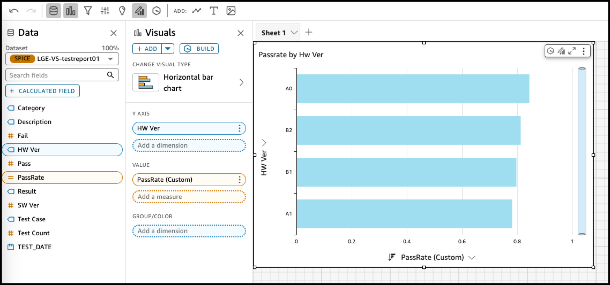
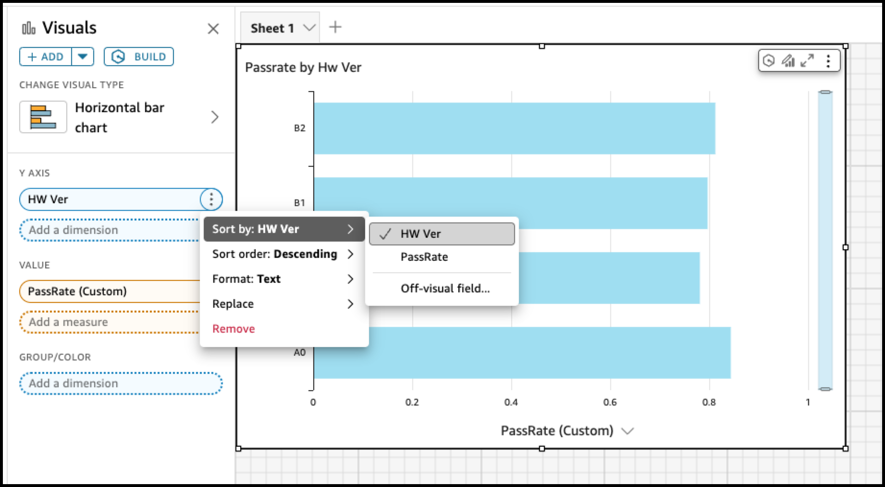
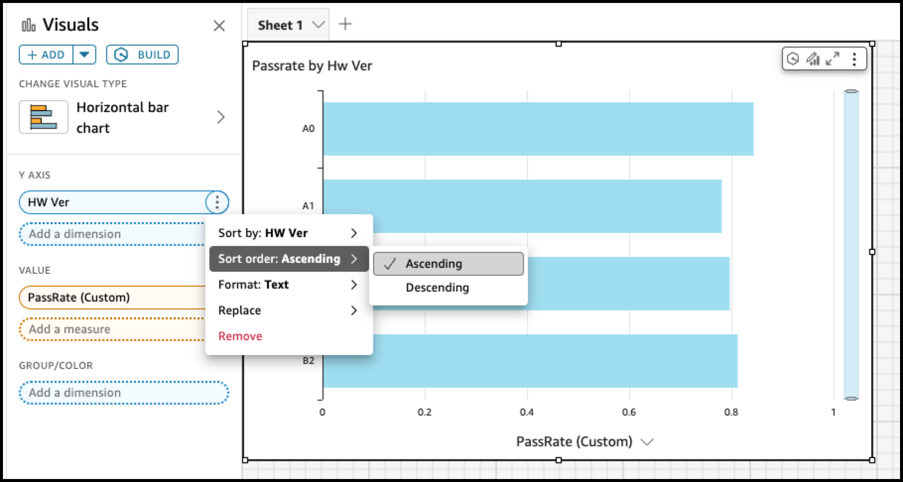

### Vertical Bar Chart Data 순서 조정

```
Sample Data : testreport01.csv
```


1. 계산식 PassRate 추가

   ```
   /*
   (AI generated) pass rate
   */
   sum(Pass) / sum({Test Count})
   ```

   

2. Horizontal Bar Chart 추가 후 아래처럼 선택

```
Y AXIS : HW ver
Value : PassRate
```




3. HW Ver 옆의 메뉴 버튼 클릭 후 **Sort by :**를 **HW Ver**로 변경




4. **Sort order:** 를 **Ascending** 으로 수정




---


