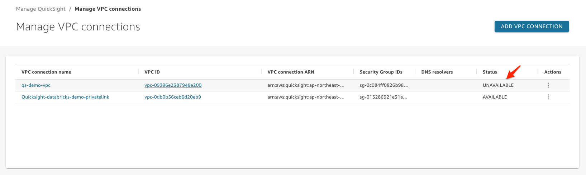
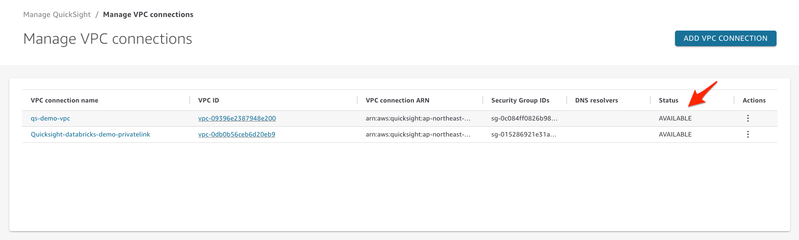
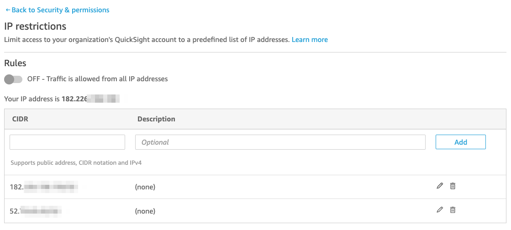

# QuickSight IP Restriction Test


---

## Private VPC Connection 구성


1. `ADD VPC Connection` 


---

1-1. VPC ADD시 `The role provided is unauthorized to perform the required actions` Error 발생 시 다음의 권한이 없기 때문

```
"quicksight:ListVPCConnections"
"quicksight:CreateVPCConnection"
"quicksight:DescribeVPCConnection"
"quicksight:DeleteVPCConnection"
"quicksight:UpdateVPCConnection"
"ec2:describeSubnets"
"ec2:describeVpcs"
"ec2:describeSecurityGroups"
"iam:ListRoles"
"iam:PassRole"
```


1-2. 해결책으로는 아래 Policy를 `aws-quicksight-service-role-v0`에 inline으로 추가

```
-- QuickSight-VPC-Policy
{
    "Version": "2012-10-17",
    "Statement": [
        {
            "Sid": "VisualEditor0",
            "Effect": "Allow",
            "Action": [
                "ec2:CreateNetworkInterface",
                "ec2:ModifyNetworkInterfaceAttribute",
                "ec2:DeleteNetworkInterface",
                "ec2:DescribeSubnets",
                "quicksight:CreateVPCConnection",
                "ec2:DescribeSecurityGroups"
            ],
            "Resource": "*"
        }
    ]
}
```


---

2. 등록 후 1분정도 후 Status가 아래처럼 `Available`로 변경 됨



```
1분정도 있으면 Available로 바뀜
```





---

3. `Anonymous Access` 허용 하기


---

4. `Dashbaord` 에서 `Share` => `Copy Link` 


---

4-1. `Anonymous Access` 가 되지 않고 Login Page가 계속 뜨는 경우 `Session Capacity`를 `Enable` 필요


```
계속 로그인 Page가 뜸

https://docs.aws.amazon.com/quicksight/latest/user/share-a-dashboard-grant-access-anyone.html
보고 조치
```


4-2. `Session Capacity` 활성화 후 아래처럼 `Anonymous Access` 가능


---

5. QuickSight의 `IP Restriction` Test


```
아래처럼 Public IP가 아닌 VPC private ip 는 적용 안됨
```


---

6. EC2의 `Public IP` 와 `EIP` 를 달아서 Test




---

6-1. 허용한 IP가 아닌 `AnyWhere` 에서 Dashboard가 접속이 되는데, `Rules` 를 `ON` 하면 IP 제한 가능


```
Rules가 아래처럼 ON상태로 변하면 IP 제한 시작
```


---

7. 허용된 IP가 아닌 Host에서는 아래와 같이 `Dashboard 접속 불가능`


---

7-1. 방금 접속이 되지 않던 EC2 IP `15.164.x.x/32` 를 Rules 에 추가 후 다시 Test


---

8. 약 3분 경과 후 `15.164.x.x/32` Host도 접속 허용(Manual에는 10분 정도 필요하다고 되어 있음)


---

9. `CLI` 를 이용하여 IP Rules를 추가 Test
10. 현재 전체 Rules를 확인

```
kiwony@kiwonymac.com:/Users/kiwony> aws quicksight describe-ip-restriction --aws-account-id $MYAC --region us-east-1

{
    "Status": 200,
    "AwsAccountId": "xxxxxxxxxxxxxxxxxx",
    "IpRestrictionRuleMap": {
        "15.164.xxx.xxx/32": "(none)",
        "182.226.xxx.xxx/32": "(none)",
        "52.79.xxx.xxx/32": "(none)"
    },
    "Enabled": true,
    "RequestId": "ba85657e-3185-44e8-9817-xxxxxxxxxxxxx"
}
```


---

11. 전체 Rules를 아래처럼 신규 조건을 추가해서 `rule-map.json` 생성

```
kiwony@kiwonymac.com:/Users/kiwony/Documents/GitHub/Quicksight/cli/update-ip-restriction> cat rule-map.json
{
        "15.164.xxx.xxx/32": "(none)",
        "182.226.xxx.xxx/32": "(none)",
        "52.79.xxx.xxx/32": "(none)",
        "203.0.113.0/32": "(none)",
        "203.0.113.1/32": "(none)",
        "203.0.113.2/32": "(none)",
        "203.0.113.3/32": "(none)",
        "203.0.113.4/32": "(none)",
        "203.0.113.5/32": "(none)",
        "203.0.113.6/32": "(none)",
        "203.0.113.7/32": "(none)",
        "203.0.113.8/32": "(none)",
        "203.0.113.9/32": "(none)",
        "203.0.113.10/32": "(none)",
        "203.0.113.11/32": "(none)",
        "203.0.113.12/32": "(none)",
        "203.0.113.13/32": "(none)",
        "203.0.113.14/32": "(none)",
        "203.0.113.15/32": "(none)",
        "203.0.113.16/32": "(none)",
        "203.0.113.17/32": "(none)",
        "203.0.113.18/32": "(none)",
        "203.0.113.19/32": "(none)",
        "203.0.113.20/32": "(none)",
        "203.0.113.21/32": "(none)",
        "203.0.113.22/32": "(none)",
        "203.0.113.23/32": "(none)",
        "203.0.113.24/32": "(none)",
        "203.0.113.25/32": "(none)",
        "203.0.113.26/32": "(none)",
        "203.0.113.27/32": "(none)",
        "203.0.113.28/32": "(none)",
        "203.0.113.29/32": "(none)",
        "203.0.113.30/32": "(none)",
        "203.0.113.31/32": "(none)",
        "203.0.113.32/32": "(none)",
        "203.0.113.33/32": "(none)",
        "203.0.113.34/32": "(none)",
        "203.0.113.35/32": "(none)",
        "203.0.113.36/32": "(none)",
        "203.0.113.37/32": "(none)",
        "203.0.113.38/32": "(none)",
        "203.0.113.39/32": "(none)",
        "203.0.113.40/32": "(none)",
        "203.0.113.41/32": "(none)",
        "203.0.113.42/32": "(none)",
        "203.0.113.43/32": "(none)",
        "203.0.113.44/32": "(none)",
        "203.0.113.45/32": "(none)",
        "203.0.113.46/32": "(none)",
        "203.0.113.47/32": "(none)",
        "203.0.113.48/32": "(none)",
        "203.0.113.49/32": "(none)",
        "203.0.113.50/32": "(none)",
        "203.0.113.51/32": "(none)",
        "203.0.113.52/32": "(none)",
        "203.0.113.53/32": "(none)",
        "203.0.113.54/32": "(none)",
        "203.0.113.55/32": "(none)",
        "203.0.113.56/32": "(none)",
        "203.0.113.57/32": "(none)",
        "203.0.113.58/32": "(none)",
        "203.0.113.59/32": "(none)",
        "203.0.113.60/32": "(none)",
        "203.0.113.61/32": "(none)",
        "203.0.113.62/32": "(none)",
        "203.0.113.63/32": "(none)",
        "203.0.113.64/32": "(none)",
        "203.0.113.65/32": "(none)",
        "203.0.113.66/32": "(none)",
        "203.0.113.67/32": "(none)",
        "203.0.113.68/32": "(none)",
        "203.0.113.69/32": "(none)",
        "203.0.113.70/32": "(none)",
        "203.0.113.71/32": "(none)",
        "203.0.113.72/32": "(none)",
        "203.0.113.73/32": "(none)",
        "203.0.113.74/32": "(none)",
        "203.0.113.75/32": "(none)",
        "203.0.113.76/32": "(none)",
        "203.0.113.77/32": "(none)",
        "203.0.113.78/32": "(none)",
        "203.0.113.79/32": "(none)",
        "203.0.113.80/32": "(none)",
        "203.0.113.81/32": "(none)",
        "203.0.113.82/32": "(none)",
        "203.0.113.83/32": "(none)",
        "203.0.113.84/32": "(none)",
        "203.0.113.85/32": "(none)",
        "203.0.113.86/32": "(none)",
        "203.0.113.87/32": "(none)",
        "203.0.113.88/32": "(none)",
        "203.0.113.89/32": "(none)",
        "203.0.113.90/32": "(none)",
        "203.0.113.91/32": "(none)",
        "203.0.113.92/32": "(none)",
        "203.0.113.93/32": "(none)",
        "203.0.113.94/32": "(none)",
        "203.0.113.95/32": "(none)",
        "203.0.113.96/32": "(none)",
        "203.0.113.97/32": "(none)",
        "203.0.113.98/32": "(none)",
        "203.0.113.99/32": "(none)",
        "203.0.113.100/32": "(none)",
        "203.0.113.101/32": "(none)",
        "203.0.113.102/32": "(none)",
        "203.0.113.103/32": "(none)",
        "203.0.113.104/32": "(none)",
        "203.0.113.105/32": "(none)",
        "203.0.113.106/32": "(none)",
        "203.0.113.107/32": "(none)",
        "203.0.113.108/32": "(none)",
        "203.0.113.109/32": "(none)",
        "203.0.113.110/32": "(none)",
        "203.0.113.111/32": "(none)",
        "203.0.113.112/32": "(none)",
        "203.0.113.113/32": "(none)",
        "203.0.113.114/32": "(none)",
        "203.0.113.115/32": "(none)",
        "203.0.113.116/32": "(none)",
        "203.0.113.117/32": "(none)",
        "203.0.113.118/32": "(none)",
        "203.0.113.119/32": "(none)",
        "203.0.113.120/32": "(none)",
        "203.0.113.121/32": "(none)",
        "203.0.113.122/32": "(none)",
        "203.0.113.123/32": "(none)",
        "203.0.113.124/32": "(none)",
        "203.0.113.125/32": "(none)",
        "203.0.113.126/32": "(none)",
        "203.0.113.127/32": "(none)",
        "203.0.113.128/32": "(none)",
        "203.0.113.129/32": "(none)",
        "203.0.113.130/32": "(none)",
        "203.0.113.131/32": "(none)",
        "203.0.113.132/32": "(none)",
        "203.0.113.133/32": "(none)",
        "203.0.113.134/32": "(none)",
        "203.0.113.135/32": "(none)",
        "203.0.113.136/32": "(none)",
        "203.0.113.137/32": "(none)"
}
```


---

12. 신규 `rule-map.json`은 약 140개의 Entry를 가지고 있으며, update 시 아래와 같이 에러 발생

```
kiwony@kiwonymac.com:/Users/kiwony/Documents/GitHub/Quicksight/cli/update-ip-restriction> wc -l rule-map.json
     143 rule-map.json

kiwony@kiwonymac.com:/Users/kiwony/Documents/GitHub/Quicksight/cli/update-ip-restriction> aws quicksight update-ip-restriction --aws-account-id $MYAC --ip-restriction-rule-map file://rule-map.json --region us-east-1

An error occurred (LimitExceededException) when calling the UpdateIpRestriction operation (reached max retries: 2): Failed to update account ip restriction. The aws account: xxxxxxxxxxxxx can only have up to 100 ip restriction rules. Failed to complete ip restriction updates for account xxxxxxxxxxxxxxx.
```


---

13. 신규 `rule-map-90.json` 은 약 90개의 Entry를 가지고 있으며, update 성공( 현재 IP Restriction Limit이 100개이기 때문)

```
kiwony@kiwonymac.com:/Users/kiwony/Documents/GitHub/Quicksight/cli/update-ip-restriction> wc -l rule-map-90.json
      90 rule-map-90.json

kiwony@kiwonymac.com:/Users/kiwony/Documents/GitHub/Quicksight/cli/update-ip-restriction> aws quicksight update-ip-restriction --aws-account-id $MYAC --ip-restriction-rule-map file://rule-map-90.json --region us-east-1
{
    "Status": 200,
    "AwsAccountId": "xxxxxxxxxxxxxxxx",
    "RequestId": "cf8ea01f-f3c9-41a7-ad5a-xxxxxxxxxxx"
}
```


---

## Appendix 

```
현재 IP 제한 갯수는 100개이며, Service Quota에서 요청 Page가 존재하지 않음
```

```

```


---

### 참고

```
https://repost.aws/knowledge-center/quicksight-redshift-private-connection

아직 보진 않았으나 유용할듯
https://www.youtube.com/watch?v=TcZuNPQ-QlA

```


